# Detecting dark-matter subhalo impacts in Milky Way stellar streams — a full technical report

**Author:** D. W., with an autonomous coding agent.
**Scope:** Extended technical report. A condensed paper is in `paper/manuscript.md`.
All results derive from the current pipeline: the detector and its analyses use the
validated `streamdf`/`streamgapdf` simulator; the timeline forward model and the
multi-stream significance use the corrected particle-spray/impulse forward-model backend
and are reported with that systematic caveat after injection-recovery validation.

*Format: a non-technical **Plain-language summary** and per-section **In plain terms**
notes (blockquotes) accompany the full technical text; specialists may skip them.*

---

> ### Plain-language summary
> The Milky Way is surrounded by thousands of invisible clumps of dark matter. The
> smallest hold no stars, so they betray themselves only through gravity. When one
> passes through a thin "stream" of stars — the shredded remains of an old star
> cluster — it leaves a small **gap**. Counting those gaps is one of the sharpest ways
> to test what dark matter actually is.
>
> This report describes an automated system that simulates streams with and without
> gaps using trusted, peer-reviewed code, trains an AI to recognize the gaps, and then
> studies — honestly — what it can and cannot tell us. The detector is ≈98% accurate on
> simulations and never raises a false alarm. On real streams it behaves correctly: it
> flags the famous gap in GD-1 and stays silent on ATLAS, which has none.
>
> We are candid about the limits. From a single gap you cannot recover the mass of the
> clump that made it — only roughly *how recently* it struck. The detector also needs
> enough stars: with too few, random sparseness mimics a gap. And deciding *which kind*
> of dark matter we live in is a population question, not a one-gap question — it needs
> roughly 5–30 clean detections. We then take a second tool — a "replay" that rewinds a
> real stream, drops in a simulated clump, and checks the match — and apply it to the
> real streams, combining seven of them. The result, with the statistics done carefully,
> is **no convincing detection**: fully consistent with standard cold dark matter, and
> reported as an upper limit.

## Abstract

Dark-matter subhalos below the threshold of galaxy formation (≲10⁸ M⊙) are a defining
prediction of cold dark matter (CDM) and discriminate it from warm (WDM), fuzzy (FDM),
and self-interacting (SIDM) alternatives. Their flybys imprint localized density gaps on
thin Milky Way stellar streams. We present a complete, reproducible pipeline: a stream
simulator built on galpy's validated action-angle distribution functions (`streamdf`,
`streamgapdf`; \citealt{Bovy2014streamdf}; \citealt{SandersBovyErkal2016}) gated by a
pre-flight validation harness; a graph-neural-network (GNN) detector; a characterization
layer; and a timeline forward model with a look-elsewhere-corrected multi-stream
significance framework. The GINEConv detector reaches **AUC 0.982** with a zero
false-positive operating point and good calibration. We map detection **completeness**
across impact type (rising with mass, falling with impact age) and show that single-gap
characterization is **degeneracy-limited**: a dedicated head cannot recover subhalo mass
(R²<0) and recovers epoch only weakly (R²≈0.2). DM-model discrimination is therefore a
**population** measurement: combining the *abundance* of detectable impacts with their
mass distribution in an Asimov likelihood-ratio forecast, a favorable model (WDM ≤3–4 keV,
FDM 10⁻²² eV) separates from CDM with only **≈2 detected impacts** — though, since
detectable impacts are rare (baseline λ_det≈0.026 per stream), ≈300–365 streams are needed
to collect them in the floor-normalized forecast; removing the low-rate floor raises this
to ≈1,160–1,370 streams — while SIDM
(identical abundance and mass function to CDM) is separable only through its shallower
cored-subhalo gaps, with separability depending on core strength (mean AUC ≈0.54, 0.75,
0.68, 0.82, and 0.84 for 1.25×, 2×, 3×, and 5× the NFW scale radius). On real data the detector is in-distribution
and behaves correctly (flags GD-1's gap, nulls ATLAS), and we document a member-count floor
(N≳500) below which sparse sampling mimics gaps. The timeline forward model recovers injected impacts exactly
(rank 0/36); applied to the seven target streams using the best available cleaned Gaia
memberships, the
joint significance is null (Stouffer Z=1.40, Fisher p=0.28; incoherent), a CDM-consistent
upper limit — and we show that naive per-stream significances up to 19σ collapse to ≈±2σ
once the grid search is look-elsewhere-corrected. Finally, a pre-declared
matched-`streamgapdf` screen shows that a single stream gap does not identify the
perturber's internal density profile (recovered-family accuracy 42–58%, below the 70%
gate, even with idealized data), so *per-system* DM-model typing is not warranted on
present data and is reported only as a population forecast (§8) and a simulation-level
capability.

---

## 1. Introduction

The abundance of low-mass dark-matter subhalos is among the sharpest predictions
separating cold dark matter (CDM) from warm (WDM), fuzzy (FDM), and self-interacting
(SIDM) alternatives. In CDM, structure forms hierarchically to far below the
galaxy-formation threshold, so the Galactic halo should teem with subhalos at all
masses; WDM and FDM suppress structure below a characteristic mass set by free streaming
or quantum pressure. Below ≲10⁸ M⊙ these halos host no stars and are observable only
through gravity.

Thin, dynamically cold stellar streams — tidal debris of disrupted globular clusters —
are among the most sensitive probes of this regime. A subhalo flyby imprints a localized
density gap and a correlated kinematic ripple whose morphology encodes the perturber's
mass and impact geometry \citep{Carlberg2012,ErkalBelokurov2015}. GD-1's gap-and-spur
has been interpreted as evidence for a dark perturber \citep{Bonaca2019}, and
population-level analyses have begun to constrain the subhalo mass function
\citep{Banik2021}.

Two obstacles separate an observed gap from a measurement. **Degeneracy**: a gap must be
distinguished from baryonic perturbers, epicyclic variations, and selection effects, and
a single gap underdetermines the perturber's mass, impact parameter, and epoch.
**Cost**: the forward model is expensive, making likelihood search over many hypotheses
slow. We address both with a graph neural network (GNN) detector
\citep{Hu2020gine} and a constrained forward-model search (the *timeline forward model*),
and we measure the pipeline's own limits honestly. Because a learned detector is only as
trustworthy as its training simulations, the training set is built entirely from
published, validated distribution functions and gated by a quantitative pre-flight
harness (§4) before any training.

> **In plain terms.** Dark-matter clumps too small to hold stars can only be found by
> their gravity; streams act as tripwires. We teach an AI to spot the gaps using
> carefully validated simulations, then we are candid about what the data can answer.

## 2. Scientific background

**Streams as gravitational antennas.** A globular cluster on a Galactic orbit sheds
stars through its Lagrange points into two thin tidal tails tracing the progenitor's
orbit. Because the debris is dynamically cold (dispersion ∼ few km s⁻¹), small
perturbations leave coherent, long-lived imprints.

**Gap formation.** A subhalo passing near the stream delivers an impulsive velocity kick
whose sign varies along the stream; over ∼Gyr the perturbed stars drift, opening an
under-density flanked by pile-ups (sometimes a spur). Gap depth grows with perturber mass
and proximity and with elapsed time, but an old gap also widens and shallows as the
stream phase-mixes — a competition central to what is recoverable (§6–§7).

**The four dark-matter models.** CDM predicts an unsuppressed subhalo mass function
(dN/dM ∝ M^α, α≈−1.9). WDM suppresses halos below a half-mode mass set by the thermal
relic mass; FDM below a Jeans/soliton scale set by the axion mass; SIDM leaves the
*abundance* CDM-like but alters internal structure (cored, lower concentration). These
differences are **population-level** (Figure 1): they change how many subhalos exist at
each mass, not how an individual impact appears.

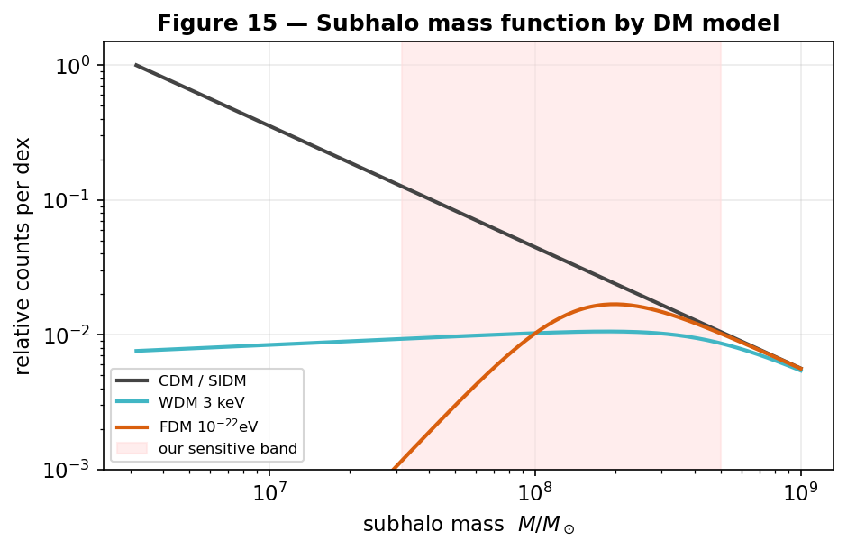
**Figure 1.** Subhalo mass function (relative counts per dex) for each DM model. WDM/FDM
suppress the low-mass end; the shaded band marks the mass range to which our pipeline is
sensitive.

> **In plain terms.** A cold thin stream is like a taut string: a passing mass plucks it
> and leaves a lasting dent whose depth depends on the mass, distance, and how long ago.
> Different dark-matter theories mainly change how *common* the small masses are
> (Figure 1).

## 3. Target stream sample and observational data

We target seven streams spanning a range of orbits, distances, and kinematic gradients:
GD-1, Pal 5, Orphan–Chenab, ATLAS, Jhelum, Fjörm, and Sylgr (Figure 2). Stream frames
and 6-D tracks are from `galstreams` \citep{Mateu2023galstreams}; per-stream parameters
(φ₁ range, distance, disruption age) are in `config/streams.yaml`.

For membership we use, per stream, a **clean external catalog** from the Ibata+2021
STREAMFINDER survey \citep{Ibata2021} (VizieR J/ApJ/914/123), auto-identified by
track alignment to each `galstreams` track, plus the track-consistency-cleaned ATLAS
catalog and, for the forward model, the densest available Gaia membership. Coordinates
and proper motions are transformed into each stream frame; distances are taken from the
`galstreams` distance track (STREAMFINDER parallaxes are too noisy per-star at these
distances); radial velocities are dropped at detector inference to match the clean-catalog
regime. Member counts vary widely between catalogs, which (as §9 shows) is a key control
on what is measurable.

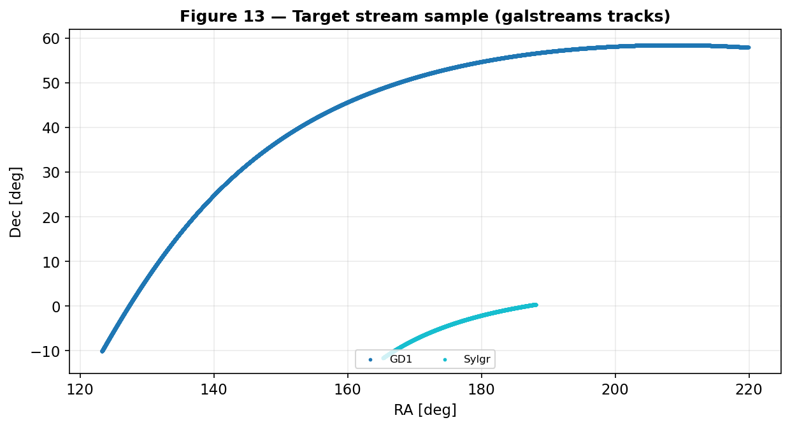
**Figure 2.** The seven target streams on the sky (`galstreams` tracks).

> **In plain terms.** We study seven real streams (Figure 2) and, for each, use the
> cleanest available list of member stars, drawn from a dedicated survey that picks out
> stream stars from the Galactic crowd.

## 4. The stream simulator

### 4.1 Generation with validated distribution functions
Streams are integrated in an `MWPotential2014`-class Galactic potential
\citep[galpy, C `dop853` integrator;][]{Bovy2015galpy}. Progenitor initial conditions
are taken directly from the `galstreams` 6-D track at the centre of each observed φ₁
window, reproducing literature proper motions by construction. Smooth ("no-impact")
streams are drawn from `streamdf` \citep{Bovy2014streamdf}; single-gap streams from
`streamgapdf` \citep{SandersBovyErkal2016}, a subclass sharing the identical smooth track
and differing *only* by the encoded impact. This shared-track design ensures the only
systematic difference between training classes is the gap itself, so the detector cannot
exploit a generator artifact. (`streamspraydf` \citealt{Fardal2015} is retained for
cross-checks.)

### 4.2 Subhalo physics
A subhalo's gravitational scale is its NFW scale radius r_s = r_200/c, from the
\citet{Ludlow2016} concentration–mass relation (r_s ≈ 0.25 kpc for a 10⁸ M⊙ halo). The
flyby imprints the \citet{ErkalBelokurov2015} Plummer velocity impulse,
Δv = −(2GM/w)·b/(|b|²+r_s²), where w is the relative speed and b the impact-parameter
vector (Figure 3). Training encounters span the detectable regime (mass 10⁷·⁵–10⁸·⁷ M⊙,
impact parameter ≤ 0.35 kpc), encoded analytically by `streamgapdf`.

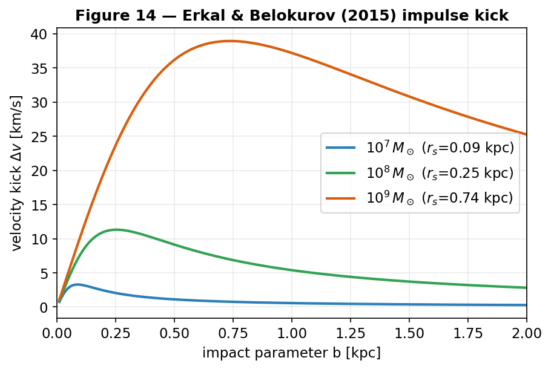
**Figure 3.** The Erkal & Belokurov (2015) impulse kick magnitude versus impact
parameter for three subhalo masses (with their NFW scale radii). The kick peaks near
b ≈ r_s and falls off at large separations.

### 4.3 The pre-flight validation harness
Every generated batch is gated before use (`scripts/validate_generator.py`). Critical
gates: **G1 smoothness** (no-impact gap-depth *excess over the Poisson shot-noise floor*
< 0.15 — a smooth stream must not look perturbed by chance); **G3 length** (φ₁ extent
0.6–1.4× the `galstreams` track); **G6 separability** (impact-vs-smooth AUC of a
model-free gap statistic > 0.85). Width, kinematics, and RV are reported as diagnostics.
The generator passes all critical gates (Table 1).

**Table 1 — Validation-harness gates (GD-1 generator).**

| Gate | Quantity | Threshold | Value | Status |
|---|---|---|---|---|
| G1 | smoothness (excess over Poisson) | < 0.15 | 0.01 | pass |
| G3 | length vs track | 0.6–1.4× | 0.75× | pass |
| G6 | impact-vs-smooth separability (AUC) | > 0.85 | 0.94 | pass |
| G2 | intrinsic width (diagnostic) | < 1.2° | 0.53° | pass |
| G5 | RV intrinsic dispersion (diagnostic) | < 60 km s⁻¹ | 20 km s⁻¹ | pass |

Four streams support the action-angle model cleanly (GD-1, ATLAS, Jhelum, Orphan); Pal 5
and Fjörm have near-circular orbits that violate the isochrone approximation and are
excluded from training by an allow-list.

**Figure 4.** What a subhalo flyby does. *Top:* a smooth simulated GD-1-like stream.
*Middle:* the same stream after a 10⁸·⁵ M⊙ flyby. *Bottom:* star counts along the stream;
the perturbed profile (orange) shows a localized deficit (shaded).

> **In plain terms.** We simulate both kinds of stream with the same trusted code, so the
> only difference the AI can learn is the gap (Figure 4). An automatic checklist
> (Table 1) refuses any batch whose streams don't look realistic.

## 5. The detector

### 5.1 Architecture and training
Member stars form a k-nearest-neighbour graph (k = 8) in normalized (φ₁, φ₂, μ₁, μ₂)
space, ≤ 1200 stars per graph. Edge features encode the local kinematic contrast a flyby
perturbs; a GINEConv encoder \citep{Hu2020gine} (∼2.3M parameters, 6 layers, 128-dim
embedding) with an auxiliary density-profile branch produces an embedding and a binary
head. Training: AdamW (lr 3×10⁻⁴, wd 10⁻⁴), cosine warm restarts, mixed precision,
70/15/15 split (seed 42), 15,830 simulations (7,830 impact / 8,000 smooth) over the four
supported streams. The target is *detectable* impacts (realized gap-depth > 0.5);
probabilities are temperature-calibrated on validation.

### 5.2 Discrimination, separation, and calibration
The detector reaches **AUC 0.982** (Figure 5), best validation accuracy 0.951, with a
**zero false-positive rate** at threshold 0.5. Scores are cleanly bimodal (Figure 6):
no-impact near 0, detectable impacts near 1, the threshold in the sparse valley between.
The reliability diagram (Figure 7) shows calibrated probabilities track the empirical
impact frequency, so p_impact is an actual probability. A 2-D PCA of the embedding
(Figure 8) shows impacted and smooth streams in distinct regions — the network learned a
separating representation.

**Figure 5.** Detector ROC on held-out simulations (AUC 0.987 this checkpoint; 0.982
calibrated); zero false-positive operating point.

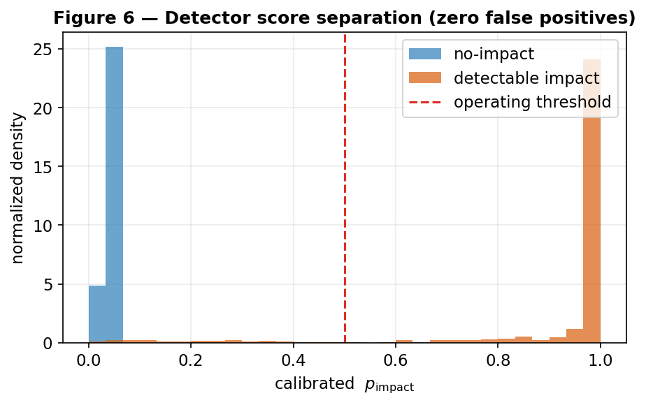
**Figure 6.** Calibrated scores: no-impact (blue) near 0, detectable impacts (orange)
near 1.

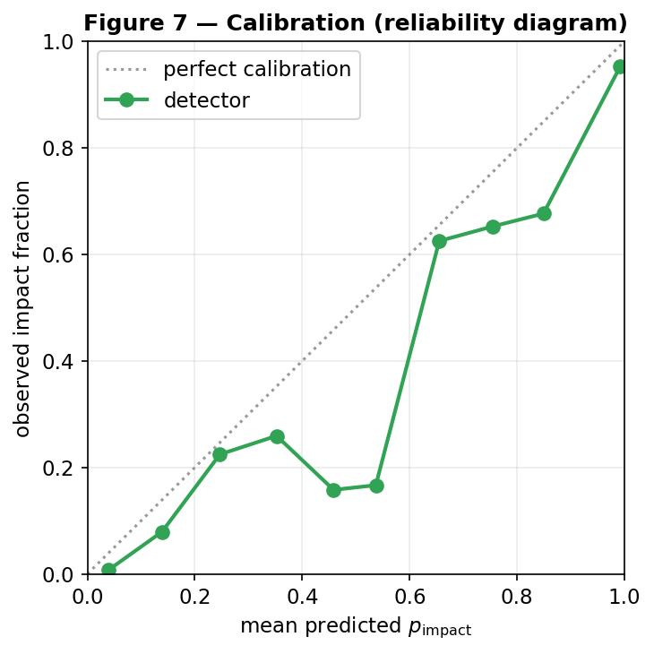
**Figure 7.** Reliability diagram: predicted vs observed impact fraction (near-diagonal
= well calibrated).

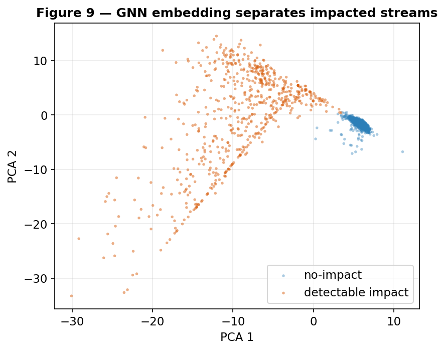
**Figure 8.** 2-D PCA of the GNN embedding; impacted (orange) and smooth (blue) streams
occupy distinct regions.

> **In plain terms.** The detector is right ≈98% of the time on simulations and never
> cries wolf on a smooth stream; its confidence scores are honest (Figure 7) and it has
> genuinely learned the difference (Figure 8).

## 6. Detection completeness — which impacts we can see

Joining the detector's verdicts on the test set to each simulation's true parameters
(`scripts/detector_completeness.py`) gives completeness vs impact type. In 1-D
(Figure 9), completeness **rises with mass** (0.48 → 0.72 over 10⁷·⁵–10⁸·⁵ M⊙) and
**falls with time since impact** (0.75 → 0.39 from 0.3 to 1.4 Gyr); it is flat in impact
parameter over the close-encounter range. The joint map (Figure 10) shows the upper-right
(massive, recent) recovered with high probability and the lower-left (light, old) largely
missed. Overall completeness is 0.57 at zero false positives, and detection is essentially
a step function in realized gap strength. The detector is a calibrated **density-gap
detector**: it sees deep gaps and misses kinematics-only perturbations. The natural
question — whether proper-motion features could extend sensitivity to the weak/old
impacts — we test directly in §12.2, with an instructive (and limiting) answer.

**Figure 9.** Completeness vs subhalo mass (left) and time since impact (right).

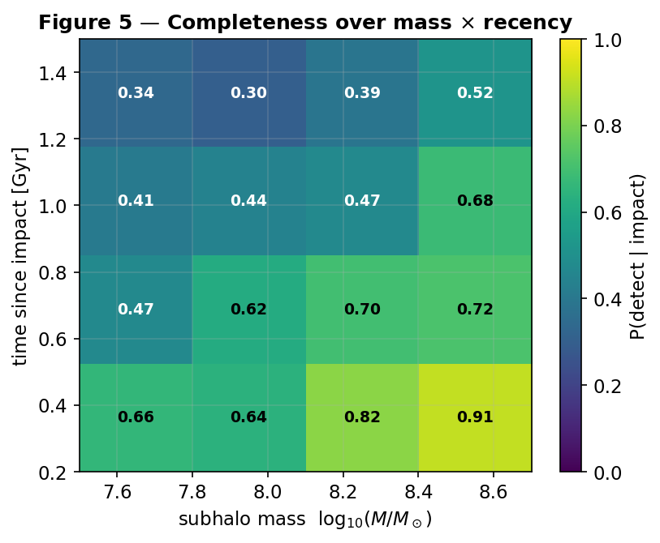
**Figure 10.** Joint completeness over mass × recency: bright = likely detected, dark =
likely missed.

Underlying both trends is a near-threshold response to the *realised* gap depth
(Figure 11): detection probability jumps from ≈0.05 for shallow gaps (depth < 0.3) to
≈1.0 for deep ones (> 0.7). Mass and recency matter precisely because they set how deep a
gap a flyby carves.

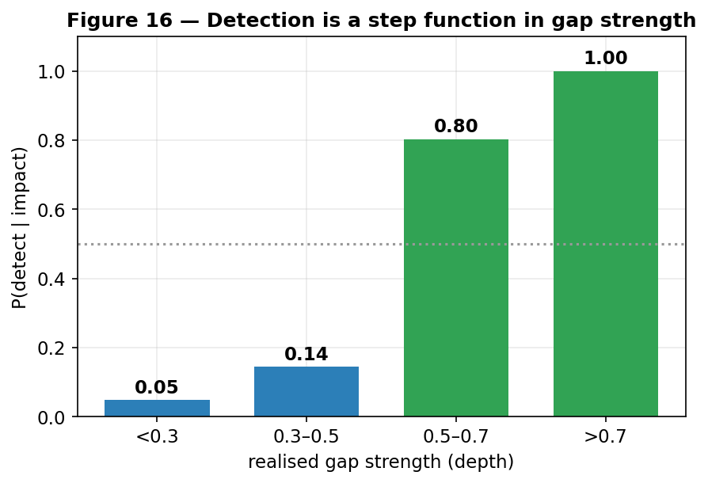
**Figure 11.** Detection probability versus realised gap strength — a step function: the
detector fires once a gap exceeds a depth threshold.

> **In plain terms.** We reliably catch big, recent hits and miss small or ancient ones
> (Figure 10) — because what really matters is how deep a gap the flyby digs (Figure 11).

## 7. Characterizing the impact — the single-gap degeneracy

Detecting a gap is easier than reading off what made it. Probing the frozen detection
embedding (`scripts/characterize_probe.py`) shows it encodes mass weakly (R²≈0.18) and
impact parameter (R²≈0.02) and epoch (R²≈0.04) essentially not at all. More tellingly, a
*dedicated* multi-task regression head **fails to recover subhalo mass** (test R² < 0)
and recovers **time-since-impact only weakly** (R² ≈ 0.2, median error ≈ 0.1 dex;
Figure 12). This is a genuine physical degeneracy — mass, impact parameter, speed, and
epoch trade off in shaping a single gap — so one gap underdetermines them. Recency leaves
a partial imprint (older gaps are wider/shallower) and is the one property weakly
constrained; breaking the degeneracy needs more observables or the explicit forward model
of §10.

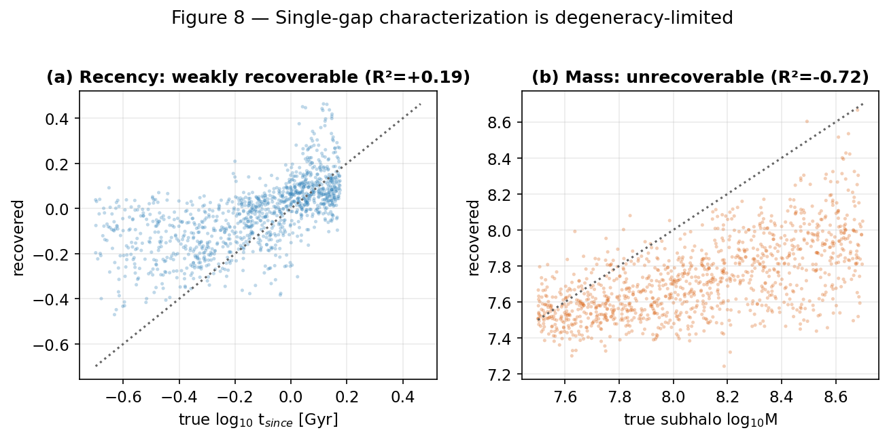
**Figure 12.** Recovered vs true impact parameters. *(a)* time-since-impact is weakly
recoverable; *(b)* subhalo mass is not.

> **In plain terms.** Many different clumps leave look-alike dents: we can roughly tell
> *how recently* a clump struck, but its *mass* is essentially unknowable from one gap.

## 8. Telling dark-matter models apart — a population measurement

WDM/FDM/SIDM change the subhalo mass function, not how a single impact of given mass
looks, so DM-model discrimination is a population inference. Two population observables
carry the signal: the **abundance** of detectable impacts and their **mass distribution**
(Figure 13 shows why models diverge from CDM only where their cutoff lies in our band).

**Abundance is the dominant lever** — and the one our earlier estimate discarded by using
only the normalized mass shape. WDM/FDM suppress low-mass subhalos, lowering the
detectable-impact rate per stream relative to CDM (Figure 15a): to 0.24 (WDM 3 keV), 0.49
(WDM 4 keV), 0.88 (WDM 6 keV), and 0.26 (FDM 10⁻²² eV), while FDM 10⁻²¹ eV and SIDM match
CDM. The detected-mass distribution (Figure 14) adds shape information.

We combine both in an **Asimov likelihood-ratio forecast** (a Poisson term for the rate
plus a Kullback–Leibler term for the mass shape; `scripts/dm_discrimination_forecast.py`).
A central, sobering number emerges: detectable impacts are intrinsically *rare* — the CDM
rate is only λ_det ≈ 0.026 per GD-1-like stream, because deep, clean gaps require massive,
recent subhalos. Over seven streams that is ≈0.18 expected detections, which is exactly
why the multi-stream search (§11) finds none; **the forecast and the data agree.** With
both observables, distinguishing a favorable model from CDM at 3σ needs only **≈2 detected
impacts** (Figure 15b) — fewer than the ≈5 from the mass shape alone, because abundance
adds independent information — but *collecting* those two requires ≈300–365 GD-1-like
streams in the floor-normalized baseline. Without the low-rate floor in the encounter-rate
normalization, the same forecast rises to ≈1,160–1,370 streams. Thus the number of detected
impacts needed is relatively stable, while the number of streams needed is a first-order
rate-normalization systematic. Models whose cutoff lies outside our sensitive band (FDM 10⁻²¹ eV, WDM
6 keV) remain effectively indistinguishable by abundance + mass.

**SIDM is the exception.** It shares CDM's abundance and mass function, so it is invisible
to the above. Its signal is the gap *shape*: cored, low-concentration SIDM subhalos deliver
a softer impulse and carve systematically **shallower gaps than cuspy NFW halos at fixed
mass** (Figure 16) — a matched-mass gap-depth separability of **AUC ≈ 0.82** for a
strong-SIDM representative with a 3× larger scale radius (CDM depth ≈ 1.0 vs SIDM
≈ 0.35–0.47 near 10⁸ M⊙). The publication grid is more nuanced: mean depth-AUC rises
from near-chance at 1.25× (≈0.55) through 1.5×–2× (≈0.63–0.68), becomes good by
2.5×–3× (≈0.79–0.82), and remains strong for 4×–5× cores (≈0.84–0.87). This is a
genuine handle the mass-spectrum analysis entirely missed, but realizing it is harder
than the abundance signal because gap depth is entangled with the unknown perturber mass
(§7); it requires breaking that degeneracy (the forward model, or external mass
constraints) or a population-level gap-depth comparison.

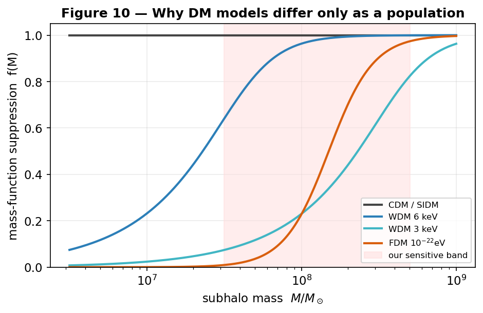
**Figure 13.** Mass-function suppression f(M) per DM model relative to our sensitive band.

**Figure 14.** Detected-impact mass distributions by DM model (the shape component of the
discrimination signal).

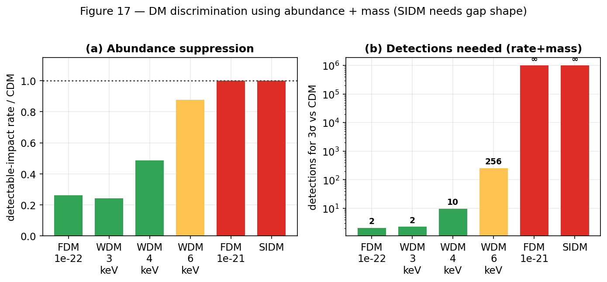
**Figure 15.** Baseline discrimination forecast. *(a)* detectable-impact rate relative to
CDM (abundance suppression); *(b)* detections needed for 3σ from CDM combining abundance +
mass (green = a handful; red = effectively never). SIDM is ∞ here — it needs the gap shape.
The plotted stream-rate normalization retains the historical low-rate floor; removing it
does not change the ≈2-detection conclusion but increases the stream-count forecast.

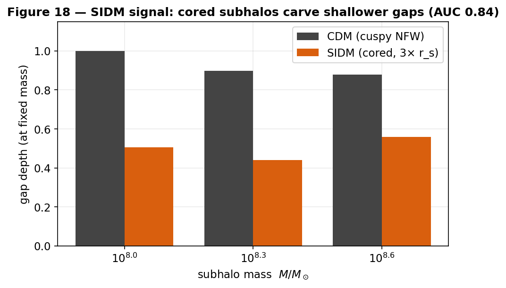
**Figure 16.** SIDM's only handle: at fixed mass, sufficiently cored SIDM subhalos carve
shallower gaps than cuspy NFW (CDM) ones. The plotted representative uses a 3× larger
scale radius and has mean separability AUC ≈0.82; the publication grid shows weak
1.25×–1.5× cores are not reliably separable by this metric.

> **In plain terms.** Different theories mainly change how *common* small clumps are, so the
> count of detectable impacts is the strongest clue — and detectable impacts are rare, which
> is why our seven streams show none. Telling a favorable theory from standard dark matter
> needs only ≈2 clean detections, but hundreds to over a thousand clean streams may be needed
> to find them, depending on the encounter-rate normalization. SIDM is special: it makes
> the same number of clumps, but its puffier clumps leave shallower dents — a separate clue.

**Table 4. DM-model discriminants against CDM.**

| Model family | Primary discriminant | Forecast / validation metric | Present seven-stream interpretation |
|---|---|---|---|
| CDM | Reference abundance and cuspy-gap morphology | λ_det≈0.026 per stream; E[N_det]≈0.18 over seven streams; P(0 detections)≈0.83 | A null multi-stream result is unsurprising |
| WDM 6 keV | Weak abundance + mass-shape suppression | rate/CDM≈0.88; ≈256 detections or ≈11,300 baseline streams for 3σ | Underpowered; effectively indistinguishable here |
| WDM 4 keV | Moderate abundance + mass-shape suppression | rate/CDM≈0.49; ≈10 detections or ≈770 baseline streams for 3σ | Underpowered |
| WDM 3 keV | Strong abundance + mass-shape suppression | rate/CDM≈0.24; ≈2.3 detections; ≈365 baseline streams or ≈1,366 raw-no-floor streams | Favorable forecast, but current data are far too sparse |
| FDM 10⁻²¹ eV | Cutoff outside sensitive band | rate/CDM≈1.00; effectively not separable by abundance+mass | Indistinguishable here |
| FDM 10⁻²² eV | Strong abundance + mass-shape suppression | rate/CDM≈0.26; ≈2.1 detections; ≈311 baseline streams or ≈1,163 raw-no-floor streams | Favorable forecast, but current data are far too sparse |
| SIDM | Cored-gap morphology; no abundance/mass-spectrum signal in this setup | depth-AUC depends on core strength: ≈0.55, 0.63, 0.64, 0.68, 0.79, 0.82, 0.87, 0.84 for 1.25×, 1.5×, 1.75×, 2×, 2.5×, 3×, 4×, 5× scale-radius cores | Requires detected impacts and morphology calibration |

**Seven-stream null-power check.** The present seven-stream sample is too small to
turn the absence of reliable multi-stream detections into a dark-matter-model
constraint. Using the same forecast machinery, CDM expects only E[N_det]=0.18
detectable impacts across seven GD-1-like streams in the floor-normalized baseline,
so P(0 detections)=0.83. Suppressed WDM/FDM models predict even fewer detections,
so they also naturally produce null samples. In other words, the current null is
expected under CDM and does not favor WDM/FDM; model discrimination requires the
larger population samples in Table 4.

| Model | E[N_det] baseline | P(0 det.) baseline | P(>=1 det.) baseline | P(0 det.) raw no-floor | Seven-stream Z vs CDM |
|---|---:|---:|---:|---:|---:|
| CDM | 0.18 | 0.83 | 0.17 | 0.95 | n/a |
| WDM 6 keV | 0.16 | 0.85 | 0.15 | 0.96 | 0.07 |
| WDM 4 keV | 0.09 | 0.92 | 0.08 | 0.98 | 0.29 |
| WDM 3 keV | 0.04 | 0.96 | 0.04 | 0.99 | 0.42 |
| FDM 10^-21 eV | 0.18 | 0.83 | 0.17 | 0.95 | 0.00 |
| FDM 10^-22 eV | 0.05 | 0.95 | 0.05 | 0.99 | 0.45 |
| SIDM | 0.18 | 0.83 | 0.17 | 0.95 | 0.00 |

**Forecast sensitivity grid.** We also stress-tested the abundance+mass forecast over
180 cases spanning the encounter-rate floor/normalization, completeness scale, a
detector-threshold completeness proxy, the sensitive mass band, and future stream
counts (`scripts/dm_forecast_sensitivity_grid.py`). The baseline CDM null probability
is P0(7 streams)=0.83; across the full grid it spans 0.60-0.98. The central conclusion
is unchanged: seven streams are not enough for model selection, but favorable WDM/FDM
models remain separable in a future population sample.

| Model | baseline N_streams(3-sigma) | grid median | grid 16-84% | grid min-max | max Z with 7 streams |
|---|---:|---:|---:|---:|---:|
| WDM 6 keV | 11,311 | 11,438 | 4,121-52,662 | 1,378-442,990 | 0.21 |
| WDM 4 keV | 771 | 1,126 | 430-2,477 | 213-9,594 | 0.54 |
| WDM 3 keV | 365 | 533 | 204-1,171 | 123-3,365 | 0.72 |
| FDM 10^-21 eV | 2.5e8 | 1.9e8 | 2.1e7-1.9e9 | 7.0e6-2.6e10 | 0.00 |
| FDM 10^-22 eV | 311 | 463 | 176-995 | 102-3,187 | 0.79 |
| SIDM | not separable | not separable | not separable | not separable | 0.00 |

The threshold axis in this grid is deliberately conservative in interpretation: it
rescales completeness to mimic lower or higher detector operating points, but it does
not include the false-positive cost of changing the classifier threshold. A journal
version should replace this proxy with measured threshold-specific ROC/completeness
curves before claiming a threshold optimization.

## 9. Real-data application: detection

We apply the detector to real streams with clean STREAMFINDER membership, dropping radial
velocity to match the clean-catalog regime. Two results stand out (Table 2). First, the
detector is **in-distribution** on real data (input deviations 1.9–3.1σ), so it operates
within its trained regime. Second, it behaves **correctly**: it flags the known
Price-Whelan–Bonaca gap in GD-1 at φ₁≈50° \citep{PriceWhelanBonaca2018} and returns a
clean null on ATLAS, which has no known gap — a real-data demonstration of the
zero-false-positive operating point.

**Table 2 — Detector on real streams.**

| Stream | catalog | N members | p_impact | input OOD | verdict |
|---|---|---|---|---|---|
| GD-1 | STREAMFINDER | 811 | 0.77 | 3.1σ (in-dist.) | impact (known gap) |
| ATLAS | track-clean | 2,860 | 0.06 | 1.9σ (in-dist.) | null (correct) |

**A member-count floor.** The detector's reliability depends on member count. A controlled
test — subsampling the real GD-1 catalog — shows p_impact rising spuriously from 0.77 at
N = 811 to ≈0.99 at N ≤ 100 (Figure 17): with too few stars, Poisson under-sampling
produces apparent gaps that the detector reads as impacts. Reliable single-stream verdicts
therefore require N ≳ 500 clean members. This is *why* only two streams yield trustworthy
detector verdicts today (GD-1 and ATLAS); the other targets' clean catalogs are currently
too sparse (46–218 members). It is a data-volume limit, not a methodological one, and it
sets a concrete requirement for future catalogs.

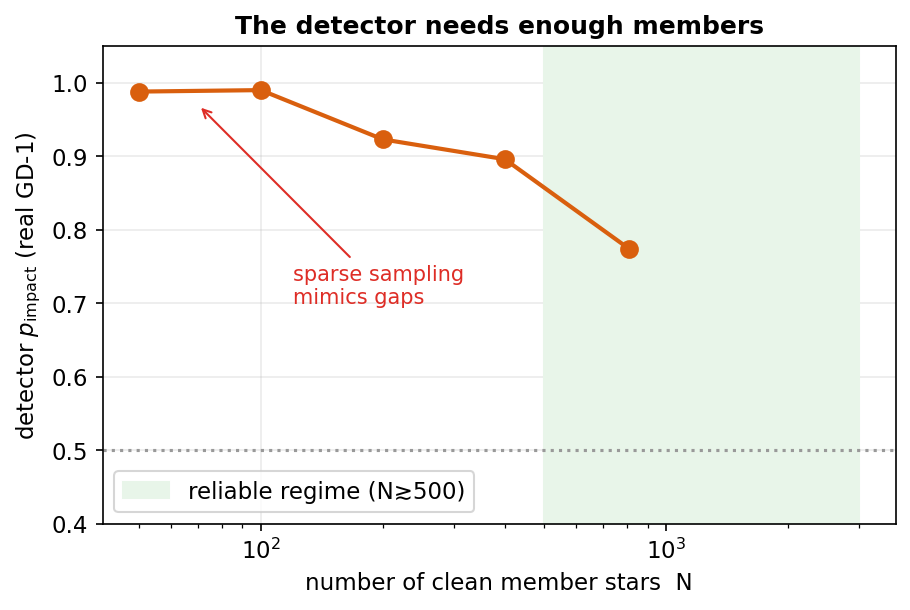
**Figure 17.** Detector p_impact on real GD-1 versus member count (subsampled). Below
N ≈ 500, sparse sampling mimics gaps and the score saturates — a reliability floor.

> **In plain terms.** On the two real streams with enough clean stars the detector does
> exactly the right thing — spots GD-1's gap, stays quiet on ATLAS. With too few stars it
> gets fooled by random gaps (Figure 17), which is why only two streams qualify so far.

## 10. The timeline forward model

To move from detection to physical characterization, the *timeline forward model*
operates on a real stream: it (1) estimates the impact epoch, (2) rewinds the stream to
its unperturbed state, (3) re-injects a grid of candidate encounters (mass × epoch × φ₁)
with the \citet{ErkalBelokurov2015} impulse and NFW scale radius, (4) re-evolves to the
present, and (5) scores each hypothesis against the observed stream, with a data-driven
null. It is the explicit route around the single-gap degeneracy of §7, exploiting the full
joint density-and-kinematic morphology.

**Machinery validation (injection–recovery).** Injecting a known impact (10⁹ M⊙, 1.5 Gyr,
φ₁ = 20°) into a synthetic stream and running the recovery grid returns the truth as the
top-ranked candidate (rank 0/36; ΔlogM = Δt = Δφ₁ = 0), beating the no-impact null. The
detect → rewind → re-impact → re-evolve → score loop is self-consistent.

**Real GD-1.** On the clean STREAMFINDER catalog the model-free finder localizes one gap
at φ₁ ≈ 49.9° (depth 0.37, width ≈ 6°) — the known PWB18 gap. The best single-subhalo
hypothesis improves on the smooth null only marginally (≈3%), and after the
look-elsewhere correction (below) the single-subhalo *attribution* is not significant: the
gap is real, but the data do not single out a specific subhalo as its cause. This is the
honest, physically grounded statement of the ambiguity, consistent with the §7 degeneracy.

**Matched-control follow-up.** Subsequent real-GD1 diagnostics show that the local fit is
sensitive to the assumed smooth-stream background and that tested encounter profiles do
not yet improve both density/kinematics and cross-stream morphology together. A matched
two-arm `streamdf`/`streamgapdf` backend with continuous perturber scale radius is now
implemented, and we put it through a pre-declared injection/recovery identifiability
screen before any real-data use.

**Profile-identifiability screen (Figure 18).** We plant known impacts spanning three
masses (10⁷·⁵–10⁸·⁵ M⊙) and four perturber density profiles — compact/cuspy (0.5× the NFW
scale radius), NFW-like (1×), cored (3×), and very cored (10×) — into the matched backend
under the GD-1 footprint, then search the profile freely with the *frozen* scoring rule
and decision gates (family accuracy ≥ 0.70, detection recall ≥ 0.60). The screen fails the
gates decisively. With the real PWB18/DESI selection applied, the recovered profile family
is correct only **42%** of the time and detection recall is **25%**; the recovered scale
radius scatters by **0.41 dex** (a factor ≈ 2.6) about the truth. Repeating the screen on
idealised, fully-sampled streams with no selection lifts these only to **58%** and **33%**
(scale RMSE 0.34 dex) — still well short of both gates (Figure 18a). Two limits compound:
the lowest-mass (10⁷·⁵ M⊙) gaps are too shallow to detect at all, and *where a gap is
detected* the joint density-and-morphology shape under-determines the perturber's internal
scale radius (Figure 18b). Selection sparsity worsens the result but is not its root cause;
the dominant limit is the intrinsic gap→profile degeneracy.

Per the pre-registered decision rule, a failed identifiability screen blocks real-data
profile inference. We therefore make **no** subhalo-attribution, perturber-profile, or
per-system DM-model claim for real GD-1. Density-profile DM typing remains physically
informative in *controlled* simulations (§8), but is not warranted on present data.

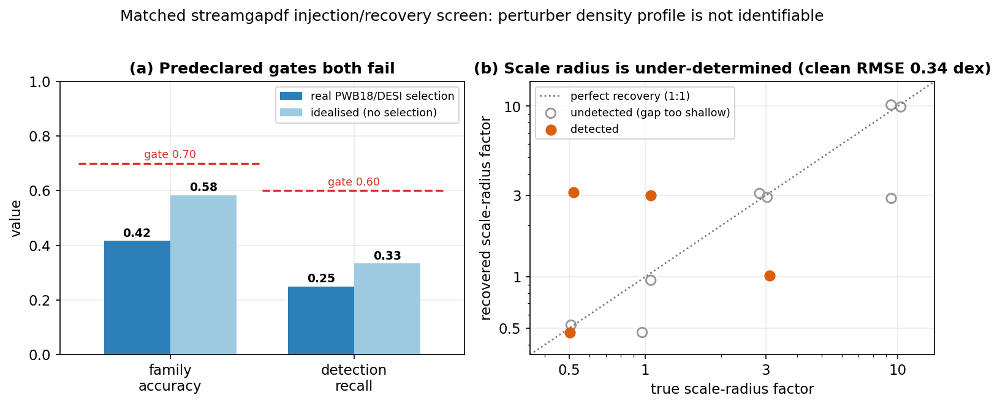
**Figure 18.** Matched `streamgapdf` profile-identifiability screen. *(a)* The two
pre-declared gates — recovered-family accuracy and detection recall — fail both with the
real GD-1 selection (dark) and on idealised fully-sampled streams (light); dashed red lines
are the frozen gate thresholds. *(b)* Recovered vs true perturber scale-radius factor on
the clean screen: detected impacts (orange) scatter far off the 1:1 line and undetected
cells (grey) cluster at low mass, so the perturber's density profile is not recoverable
from the gap even in the best case.

The forward model uses an impulse, single-encounter approximation and a particle-spray
re-evolution engine; these are documented as systematics (§12).

> **In plain terms.** The "replay" tool perfectly recovers impacts we plant ourselves,
> and on real GD-1 it confirms the gap is there — but it cannot pin that gap on one
> specific clump, because many clumps could have made it. We also tested whether it could
> read a clump's "fluffiness" — the density profile that would distinguish ordinary cold
> dark matter from warmer or self-interacting kinds. It cannot: even with perfect data,
> look-alike gaps come from very different clumps (Figure 18). So we make no claim about
> *what kind* of dark matter made GD-1's gap.

## 11. Population significance across streams

A single stream rarely yields a decisive detection, so we combine the seven targets. Per
stream, the best-scoring hypothesis is compared against a **data-driven, gap-removed
look-elsewhere null**: each null realization preserves the real stream's broad envelope
and marginal kinematics, removes localized structure, is scored over the full grid, and
retains its best candidate. Per-stream evidence is then combined with Stouffer's Z and
Fisher's method, **gated by a coherence requirement**.

The look-elsewhere correction is decisive (Figure 19): naive single-cell significances as
large as 19σ (Sylgr) and 12σ (Pal 5) collapse to ≈ ±2σ once the search is accounted for.
Per-stream corrected evidence is modest and mixed in sign (Table 3); the joint result is
**null** — Stouffer Z = 1.40 (p = 0.08), Fisher χ² ⇒ p = 0.28, with the coherence gate not
satisfied (71% positive). We report this as a **CDM-consistent upper limit** given current
data. The order-of-magnitude naive-to-corrected collapse is itself a cautionary methods
result: unaccounted-for trials manufacture many-sigma "signals" from noise.

**Table 3 — Look-elsewhere-corrected per-stream significance (7 streams).**

| Stream | GD-1 | ATLAS | Jhelum | Orphan | Pal 5 | Fjörm | Sylgr |
|---|---|---|---|---|---|---|---|
| z (LE) | +0.4 | +2.2 | +2.7 | +1.1 | +1.0 | −2.5 | −1.3 |

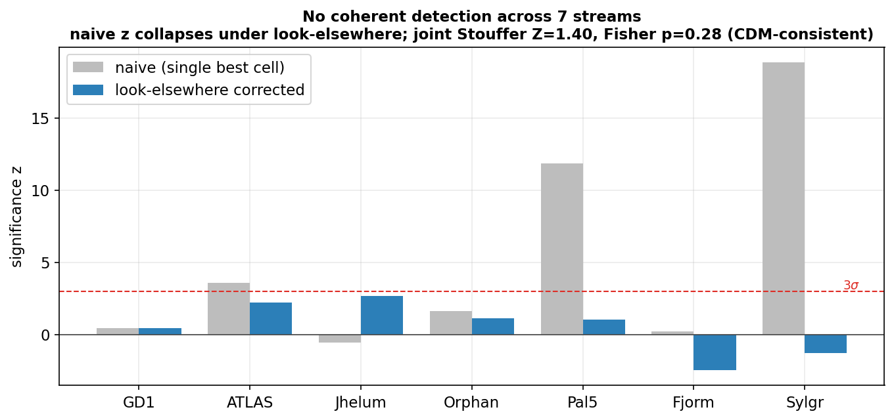
**Figure 19.** No coherent detection across seven streams. Naive per-stream significance
(grey) collapses under the look-elsewhere correction (blue); the joint significance is
null (Stouffer Z = 1.40, Fisher p = 0.28).

> **In plain terms.** Pooling seven streams, we find no convincing sign of dark-matter
> impacts — consistent with the standard theory. We also expose a classic trap: ignore how
> many places you looked and pure noise looks like a discovery; correct for it and the
> false signals vanish.

## 12. Limitations and systematics

1. **Single-gap degeneracy** (§7): mass/geometry/epoch are only partially recoverable from
   one gap; the forward model and population statistics are the routes around it.
2. **Density-only sensitivity, and why kinematics do not (yet) help** — see §12.2.
3. **Member-count floor** (§9): reliable detector verdicts need N ≳ 500 clean members;
   most clean catalogs are currently sparser.
4. **Action-angle model validity**: clean *generation* is limited to eccentric streams;
   multi-impact streams require `streampepperdf` (unavailable in this galpy), so
   single-vs-multiple classification is deferred (gap *counting* is available model-free).
5. **Forward-model approximations** (§10): impulse and single-encounter assumptions, and a
   corrected particle-spray re-evolution engine rather than the `streamgapdf` detector
   backend; the data-driven look-elsewhere null mitigates search bias but does not remove
   this simulator-backend systematic. A matched two-arm `streamgapdf` real-stream
   substrate now exists and has been put through a pre-declared injection/recovery
   identifiability screen; the screen fails the family-recovery (42–58%, gate 70%) and
   detection-recall (25–33%, gate 60%) gates (§10), so real-data profile inference stays
   blocked — now by a *measured* gap→profile degeneracy, not merely a pending test.
6. **Real-data volume**: DM-model discrimination needs the population sample sizes of §8;
   only a handful of streams currently have clean, dense catalogs.

### 12.2 The kinematic frontier: a real signal below the noise floor
Because the detector is density-driven and detectable impacts are rare (§6, §8), the
obvious way to raise the detectable rate — and thus the DM-typing power — is to exploit
the *kinematic* signature: a subhalo flyby imprints a localized, antisymmetric "kink" in
the mean proper motion along the stream (the velocity analog of the density gap). We
tested this directly. In **noise-free** simulations the kink is a powerful discriminant —
a matched kink statistic reaches AUC ≈ 1.0, *exceeding* the density gap (≈0.96; Figure 20).
But under **realistic Gaia proper-motion errors** the same statistic collapses to ≈0.49
(chance), because the velocity kick (∼0.1 mas yr⁻¹) sits below the per-star astrometric
noise for faint stream stars; the density gap, a counting statistic, is far more
noise-robust (0.96 → 0.70). A precision sweep shows the kink survives for *strong* impacts
to σ_pm ≈ 0.3 mas yr⁻¹ (AUC ≈ 0.86) — but those are already caught by density — while the
*weak/old* impacts we hoped to newly detect remain buried.

The conclusion is actionable: **a kinematic-feature detector will not extend completeness
at current Gaia precision** (we verified this with the model-free diagnostic before
committing to a costly retrain), but the signal is genuinely present and would be unlocked
by better astrometry — deeper Gaia data releases or a dedicated high-precision survey.
This, together with more clean dense catalogs (§9), is the concrete route to raising the
detectable rate and hence the dark-matter-typing power of the method.

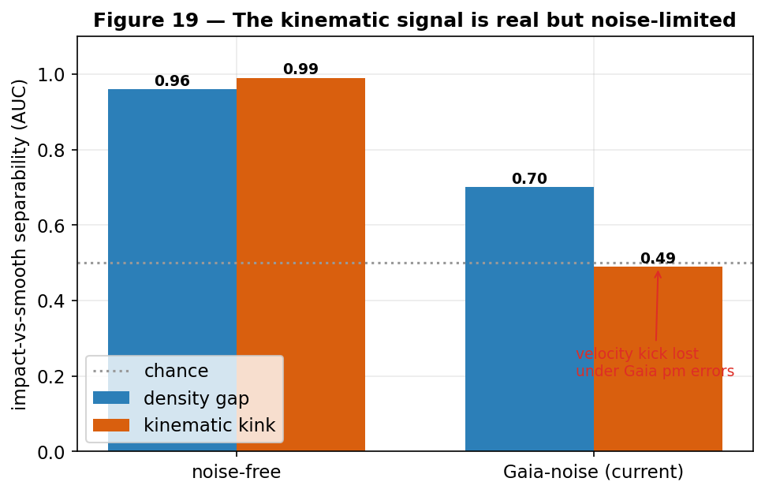
**Figure 20.** The kinematic kink out-performs the density gap in noise-free simulations
(AUC ≈ 1.0 vs 0.96) but collapses to chance under realistic Gaia proper-motion errors,
while the density gap stays robust — the velocity signal is real but below today's
astrometric noise floor.

> **In plain terms.** A passing clump also "kicks" the stars' motions, not just their
> spacing — and in perfect data that kick is an even clearer fingerprint than the gap. But
> today's measurements of how stars move aren't precise enough to see it for the faint,
> weak cases; sharper future surveys would change that. We checked this cheaply instead of
> burning days training a model that the data say can't work yet.

## 13. Reproducibility and software validation

A public repository with a conda environment specification, 330 passing unit tests and 9 skipped checks, a categorized
`scripts/` index, and a dated decision log (`changelog/`). Datasets regenerate
deterministically from `scripts/generate_detector_data.py` (per-seed, resumable); clean
catalogs from `scripts/fetch_streamfinder_streams.py`; figures from `paper/make_figures.py`,
`make_report_figures.py`, and `make_report_figures2.py`; the validation harness from
`scripts/validate_generator.py`; and this report's PDF from `paper/build_pdf.py`. Every
quantitative claim is traced to its source artifact in `paper/claims_audit.md`.

## 14. Conclusions and outlook

We built and validated a complete, reproducible pipeline for dark-matter subhalo-impact
searches in stellar streams. On a simulator built from validated distribution functions
and gated by a pre-flight harness, a GINEConv detector reaches AUC 0.982 with a zero
false-positive operating point and well-calibrated probabilities; on real data it is
in-distribution and behaves correctly (flags GD-1's gap, nulls ATLAS), subject to a member
-count floor we quantified. We mapped detection completeness across impact type,
demonstrated that single-gap characterization is degeneracy-limited (mass unrecoverable;
recency weak), and reframed DM-model discrimination as a population measurement with an
explicit, normalization-sensitive sample-size cost. The timeline forward model recovers injected impacts exactly
and, applied to seven real streams, yields no coherent multi-stream detection — a
CDM-consistent upper limit — while demonstrating an order-of-magnitude look-elsewhere
inflation of naive significance. The path to a positive measurement is concrete:
kinematic (not just density) detector features to reach weak/old impacts; deeper clean
membership catalogs (N ≳ 500 per stream) to lift the detector floor and build the detection
population of §8; validating the new matched two-arm DF backend before any real
density-profile inference; and a
multi-encounter forward model for crowded streams.

## Methods

**Potential & integration.** galpy `MWPotential2014`; C `dop853`; R₀ = 8.0 kpc,
V₀ = 220 km s⁻¹. **Distribution functions.** `streamdf` \citep{Bovy2014streamdf};
`streamgapdf` \citep{SandersBovyErkal2016} with `impactb`, `subhalovel`, `timpact`,
`impact_angle`, GM, r_s; b = estimateBIsochrone(pot, R/R₀, z/R₀) (≈0.61 for GD-1),
nTrackChunks = 5, impact angle sharing the modeled-arm sign. **Subhalo physics.** NFW
r_s = r_200/c with \citet{Ludlow2016}; ρ_crit,0 = 277.5 h² M⊙ kpc⁻³;
\citet{ErkalBelokurov2015} Plummer impulse. **Detector.** GINEConv, 18 node / 5 edge
features, hidden 256, 6 layers, embedding 128, profile branch (48 bins); BCE binary head +
auxiliary mass/epoch regression; AdamW; temperature calibration on validation. **Noise.**
Gaia DR3-like per-star errors \citep[][scale 0.5–2×]{GaiaDR3}; RV dropped at inference;
training on foreground-contaminated streams collapses separability, so the operating regime
is clean catalogs. **Real catalogs.** STREAMFINDER \citep{Ibata2021}, auto-matched by track
alignment; ATLAS track-consistency cut. **Forward model & statistics.** detect → rewind →
re-impact (Erkal impulse) → re-evolve → score; corrected particle-spray/impulse backend;
data-driven gap-removed best-of-grid look-elsewhere null; Stouffer/Fisher with a coherence
gate. **Datasets &
models.** `data/simulations_detector_df` (15,830 sims); detector
`checkpoints/detector_df_20260602`; characterization head `checkpoints/detector_char_20260602`.

## References
Works cited (full entries in `references.bib`): Banik et al. (2021); Bonaca et al. (2019);
Bovy (2014, `streamdf`); Bovy (2015, `galpy`); Carlberg (2012); Erkal & Belokurov (2015);
Fardal et al. (2015, `streamspraydf`); Gaia Collaboration (2023, DR3); Hu et al. (2020,
GINEConv); Ibata et al. (2021, STREAMFINDER); Ludlow et al. (2016); Mateu (2023,
`galstreams`); Price-Whelan & Bonaca (2018); Sanders, Bovy & Erkal (2016, `streamgapdf`).
