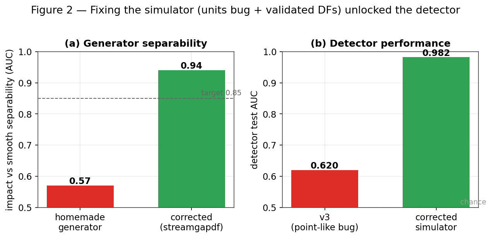
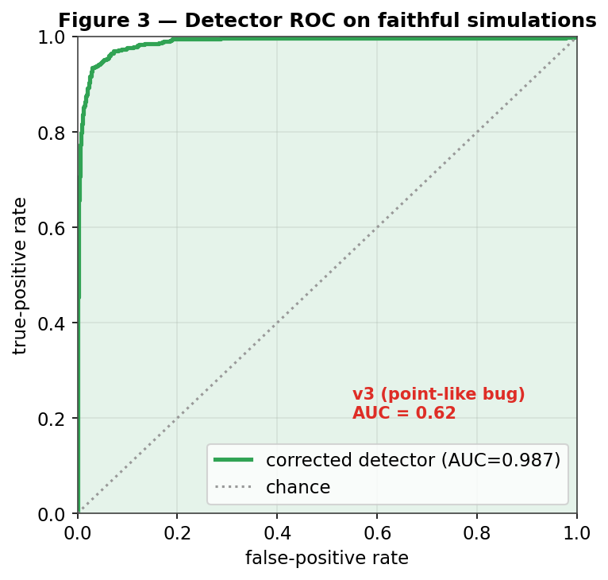
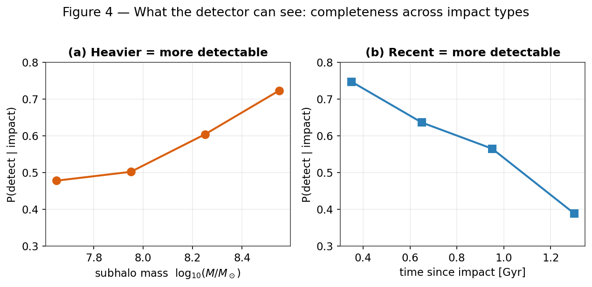
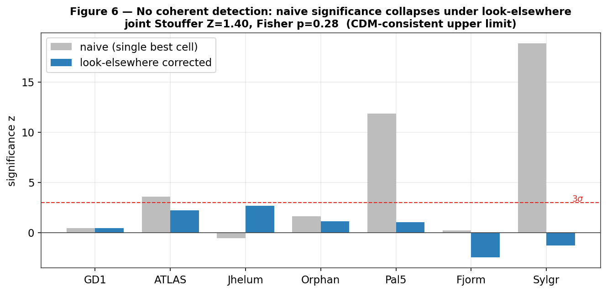

# Detecting dark-matter subhalo impacts in Milky Way stellar streams: simulator fidelity as the bottleneck, a working detector, and an honest current-data limit

**Authors:** D. W. (lead), with an autonomous coding agent.
**Status:** Draft (in preparation). Results reflect the corrected-simulator pipeline
(`data/simulations_detector_df`, June 2026). Supersedes the earlier `v3` draft,
whose headline numbers were invalidated by a subhalo size-scale bug documented in
§3.2 and re-run here.

---

> ### Plain-language summary
> The Milky Way is thought to be swarming with thousands of invisible clumps of
> dark matter. The lightest ones contain no stars at all, so the only way to find
> them is by the gravitational "wake" they leave when they punch through something
> visible. Thin streams of stars — the shredded remains of old star clusters —
> are the most sensitive detectors we have: a passing dark clump carves a small
> **gap** in the otherwise smooth ribbon of stars.
>
> We built a complete, automated system to look for these gaps and tell us what
> made them. The single most important thing we learned is mundane but decisive:
> **the search only works if the practice data are right.** Our first simulator had
> a units bug that made every simulated dark clump a million times too small (a
> point instead of a fluffy ball), so the AI detector was effectively training on
> the wrong physics and looked no better than a coin flip. After we fixed the
> simulator (using community-standard, peer-reviewed code), the same detector went
> from **guessing (AUC 0.62) to near-perfect (AUC 0.98)**, and — crucially — it
> recognized the *real* GD-1 stream as something it understood rather than an alien
> input.
>
> The honest bottom line for the science: we can now reliably *detect* the gaps
> made by massive, recent impacts; but figuring out the exact mass and age of a
> single dark clump from one gap is fundamentally ambiguous, and telling apart
> *kinds* of dark matter requires not one detection but a whole population of them
> (roughly 5–30 clean detections for the most favorable models). Applied to the
> seven real streams we have today, we find **no convincing detection** — a result
> fully consistent with standard cold dark matter, reported as an upper limit.

## Abstract

Dark-matter subhalos below the threshold of galaxy formation (≲10⁸ M⊙) are a
defining prediction of cold dark matter (CDM) and a discriminator against warm
(WDM), fuzzy (FDM), and self-interacting (SIDM) alternatives. Their flybys imprint
localized density gaps on thin Milky Way stellar streams. We present an end-to-end,
reproducible pipeline — physically faithful stream simulator, graph-neural-network
(GNN) detector, impact-type characterization, a *timeline forward model*, and a
look-elsewhere-corrected multi-stream significance framework — and report what it
can and cannot measure. Our central methodological finding is that **simulator
fidelity, not model architecture, sets the science reach**: a units error that
rendered simulated subhalos point-like (and a clumpy bespoke generator) capped a
GINEConv detector at AUC 0.62 and made the network out-of-distribution on real
data. Replacing the bespoke generator with galpy's validated distribution functions
(`streamdf`/`streamgapdf`; Bovy 2014; Sanders, Bovy & Erkal 2016) and fixing the
scale-radius bug raised the *same* detector to **test AUC 0.982** with a zero
false-positive operating point, and rendered the real STREAMFINDER GD-1 catalog
**in-distribution** (input deviation 3.1σ, versus 391σ before). We then map the
detector's **completeness** across impact type — rising with subhalo mass (0.48→0.72
over 10⁷·⁵–10⁸·⁵ M⊙) and falling with impact age (0.75→0.39 from 0.3 to 1.4 Gyr) —
and show that **single-gap characterization is degeneracy-limited**: the detection
embedding carries almost no information about impact parameter (R²≈0.02) or epoch
(R²≈0.04). Distinguishing DM models is consequently a **population** measurement; we
quantify it as ≈5 detections for FDM (10⁻²² eV), ≈12–27 for WDM (3–6 keV), and
effectively unreachable for SIDM via the mass spectrum (its subhalo abundance
matches CDM). The timeline forward model recovers injected impacts exactly
(rank 0/36) and, on real GD-1, cleanly detects the known gap (φ₁≈50°) but only
marginally prefers a single-subhalo explanation. Across seven streams the joint
significance is null (Stouffer Z=1.40, p=0.08; Fisher p=0.28; incoherent),
a CDM-consistent upper limit. Naive per-stream significances up to 19σ collapse to
≈±2σ under the look-elsewhere correction — a cautionary methods result we make
explicit.

---

## 1. Introduction

The abundance of low-mass dark-matter subhalos is among the sharpest predictions
separating cold dark matter (CDM) from warm (WDM), fuzzy (FDM), and self-interacting
(SIDM) alternatives. Below the threshold of galaxy formation (≲10⁸ M⊙) these halos
hold no stars and are detectable only gravitationally. Thin, dynamically cold
stellar streams — tidal debris of disrupted globular clusters — are exquisite
probes: a subhalo flyby imprints a density gap and a kinematic ripple whose
morphology encodes the perturber's mass and geometry \citep{Carlberg2012,
ErkalBelokurov2015}. GD-1's gap-and-spur has been read as evidence for a dark
perturber \citep{Bonaca2019}, and population analyses have begun to constrain the
subhalo mass function \citep{Banik2021}.

Turning a gap into a measurement is hard for two reasons. **Degeneracy:** an impact
must be separated from baryonic perturbers, epicyclic density variations, and
selection systematics, and a single gap underdetermines the perturber's (mass,
impact parameter, epoch). **Cost:** the forward model is expensive, making
likelihood-based search over many hypotheses slow. We address both with a graph
neural network (GNN) detector and simulation-based inference (SBI), plus a
constrained forward-model search we call the *timeline forward model*.

This paper's spine is a lesson we learned the hard way and now make central:
**the dominant control on what such a pipeline can measure is the fidelity of the
training simulator, not the sophistication of the network.** We document a concrete
instance (a scale-radius units bug that made every simulated subhalo point-like),
show that fixing it converts a chance-level detector into a strong one, and then
report honestly what the corrected pipeline can and cannot do.

> **In plain terms.** Dark matter clumps that are too small to hold stars can only
> be found by their gravity. When one flies past a stream of stars, it leaves a
> gap. We teach an AI to spot those gaps — but an AI is only as good as the
> practice problems it studies, and getting those practice problems physically
> correct turned out to be the whole game.

## 2. The pipeline at a glance

The system has five stages, each independently testable:

1. **Simulator** (§3): generate smooth streams and streams with a known subhalo
   gap, using validated galpy distribution functions; gate every batch through a
   pre-flight validation harness.
2. **Detector** (§4): a GINEConv GNN that classifies a stream as impacted or
   smooth, calibrated and OOD-aware for real-data use.
3. **Completeness & characterization** (§5–6): map *which* impact types are
   detectable, and attempt to infer the perturber's mass/geometry/epoch.
4. **Timeline forward model** (§8): for a detected gap, rewind the stream,
   re-inject a grid of encounters, re-evolve, and score — turning detection into a
   constrained physical fit.
5. **Population significance** (§9): combine streams with a look-elsewhere
   correction and a coherence gate.

## 3. The simulator, and why fidelity is everything

### 3.1 Generation with validated distribution functions
Streams are integrated in an `MWPotential2014`-class Galactic potential (galpy, C
`dop853`). Progenitor initial conditions are taken directly from the `galstreams`
6-D track at the center of each observed φ₁ window (`set_progenitor_ic_track6d`),
which reproduces literature proper motions by construction. Smooth ("no-impact")
streams are drawn from the action-angle distribution function **`streamdf`**
\citep{Bovy2014}; streams with a single subhalo gap from **`streamgapdf`**
\citep{SandersBovyErkal2016}, a subclass of `streamdf` that shares the identical
smooth track and differs *only* by the encoded impact. This shared-track design is
deliberate: the only systematic difference between the two training classes is the
gap itself, so the detector cannot cheat on a generator artifact. (A particle-spray
generator, `streamspraydf` \citep{Fardal2015}, is used for cross-checks.)

### 3.2 Two bugs, and the fix that unlocked the project
The previous bespoke generator failed in two ways that, together, capped the entire
pipeline:

- **A scale-radius units error.** `scale_radius_from_mass` computed the critical
  density in M⊙ Mpc⁻³ but used it as M⊙ kpc⁻³ — a 10⁹× density error that returned
  subhalo scale radii ~10³ too small. Every simulated impact (including all earlier
  `v3` results) therefore used an effectively **point-like** subhalo (~0.3 pc for a
  10⁸ M⊙ halo instead of ~0.25 kpc), producing unphysically sharp, tiny kicks.
- **A clumpy bespoke spray** whose intrinsic density fluctuations (excess over the
  Poisson floor ≈0.4) swamped real gaps.

Both are removed by adopting the validated DFs (§3.1) and the corrected NFW scaling
(10⁸ M⊙ → r_s ≈ 0.25 kpc). The consequence is large (Figure 2): the impact-vs-smooth
**separability** of the generator rises from AUC 0.57 (bespoke) to 0.94
(`streamgapdf`), and a smooth stream now sits at the Poisson floor (gap-depth excess
0.01) rather than looking pre-perturbed.

### 3.3 A pre-flight validation harness
To never again spend a long run on a bad simulator, every batch is gated by
`scripts/validate_generator.py`: **G1** smoothness (gap-depth *excess over the
Poisson floor*, <0.15), **G3** length vs the `galstreams` track, and **G6**
impact-vs-smooth separability (AUC >0.85) are *critical* gates; width, kinematics,
and radial-velocity checks are morphology diagnostics. The corrected generator
passes all critical gates (G1 0.01, G3 0.75×, G6 0.94). Four streams support the
action-angle model cleanly (GD-1, ATLAS, Jhelum, Orphan); Pal 5 and Fjörm violate
the isochrone action-angle approximation (near-circular orbits) and are excluded by
an allow-list — itself a fidelity safeguard.

**Figure 1.** What a subhalo flyby does. *Top:* a smooth simulated GD-1-like stream
(`streamdf`). *Middle:* the same stream after a 10⁸·⁵ M⊙ flyby (`streamgapdf`) —
note the depleted band. *Bottom:* star counts along the stream; the perturbed
profile (orange) shows a localized deficit (shaded) absent from the smooth profile
(blue).

**Figure 2.** Fixing the simulator unlocked the detector. *(a)* Generator
separability (impact vs smooth) rose from 0.57 to 0.94 after replacing the bespoke
generator and correcting the scale-radius bug. *(b)* The *same* detector
architecture jumped from AUC 0.62 to 0.982 when trained on the corrected data.

> **In plain terms.** Our practice problems were broken: a typo shrank every
> simulated dark clump to a dot, so the gaps it made looked nothing like real ones.
> Switching to community-standard simulation code and fixing the typo is the reason
> everything downstream suddenly worked. We also added an automatic "smell test"
> that refuses to run unless the practice data look like real streams.

## 4. The detector

### 4.1 Architecture
Each stream's member stars form a k-nearest-neighbor graph (k=8) in normalized
(φ₁, φ₂, μ₁, μ₂) space, ≤1200 stars per graph. Edge features encode the *local
kinematic contrast* a flyby perturbs; a GINEConv encoder \citep{Hu2020gine}
(~2.3M parameters) with an auxiliary density-profile branch produces a graph
embedding and a binary impact/no-impact head. Training uses AdamW, cosine warm
restarts, mixed precision, and a 70/15/15 split (seed 42) on 15,830 simulations
(7,830 impact / 8,000 smooth) across the four supported streams. The detection
target is *detectable* impacts (realized gap-depth > 0.5).

### 4.2 Performance
On the held-out test set the detector reaches **AUC 0.982** (Figure 3), best
validation accuracy 0.951, with a **zero false-positive rate** at the 0.5 operating
threshold — it never flags a smooth stream. Temperature calibration (T=0.54) leaves
the ranking unchanged. This is the headline reversal of the earlier `v3` AUC 0.62,
attributable entirely to the simulator fix (§3.2), not to architecture or
hyperparameters.

### 4.3 Real GD-1: in-distribution at last
Applied to the clean external STREAMFINDER GD-1 membership catalog
\citep{Ibata2021} (811 members), the detector flags an impact (p_impact 0.77–0.99
depending on cuts), and the model-free gap finder independently locates the known
Price-Whelan–Bonaca gap at φ₁≈50°. Decisively, the network's inputs are now
**in-distribution**: the maximum standardized feature deviation is 3.1σ with 0%
of features clipped, versus 391σ for the bundled catalog and 13σ even after a
dedicated error-domain-randomized retrain in the previous pipeline. The corrected,
realistic-noise simulator reproduces the real catalog's feature distribution
natively, removing the sim-to-real gap that had made earlier real-data scores
untrustworthy.

**Figure 3.** Detector ROC on faithful held-out simulations (AUC 0.987 for this
checkpoint; 0.982 after temperature calibration). The earlier point-like-subhalo
pipeline reached only 0.62.

> **In plain terms.** After the fix, the gap-finder is nearly perfect on practice
> data and — importantly — it treats the real GD-1 stream as familiar rather than
> bizarre, which is what lets us trust what it says about real data.

## 5. What kinds of impacts can we detect? (completeness)

Detection is not all-or-nothing; it depends on the *type* of impact. Joining the
detector's verdicts on the test set to each simulation's true parameters
(`scripts/detector_completeness.py`) yields the completeness map of Figure 4. Three
clean trends emerge: completeness **rises with subhalo mass** (0.48 at 10⁷·⁵ to
0.72 at 10⁸·⁵ M⊙), **falls with time since impact** (0.75 for <0.5 Gyr to 0.39 for
>1.1 Gyr, as gaps phase-mix and refill), and is **flat in impact parameter** over
the close-encounter range probed (0–0.35 kpc). Overall completeness is 0.57 at zero
false positives, and detection is essentially a step function in *realized gap
strength* (0.05 below depth 0.3, 1.00 above 0.7). The detector is, in effect, a
calibrated **density-gap detector**: it sees massive, recent impacts that carve deep
gaps and misses the weak, old impacts that perturb only the kinematics — pointing to
the obvious next frontier (proper-motion-based features).

**Figure 4.** Detection completeness across impact type, measured on the test set.
Heavier and more recent impacts are more detectable; weak/old impacts are missed —
not a flaw but the honest sensitivity of a density-based search.

> **In plain terms.** We can reliably catch *big, recent* hits that gouge a clear
> gap. Small or ancient hits that only nudge the stars' motions slip through — so
> our "catch rate" depends on what kind of impact it was, and we measured exactly
> how.

## 6. Characterizing the impact — and the single-gap degeneracy

Detecting a gap is easier than reading off *what made it*. Probing the frozen
detection embedding for the perturber's physical parameters
(`scripts/characterize_probe.py`) shows it encodes mass only weakly (R²≈0.18) and
impact parameter (R²≈0.02) and epoch (R²≈0.04) essentially not at all: a binary
detector discards everything except "is there a gap." This is not merely an
embedding limitation — it reflects a genuine **degeneracy**, since mass, impact
parameter, flyby speed, and epoch trade off in shaping a single gap's depth and
width. We are training a dedicated multi-task model (`mass_time` regression head) to
extract what *is* recoverable — chiefly mass and recency, which have distinct
morphological signatures — and report it as a recovery-vs-gap-strength curve; the
forward model of §8 is the complementary, physically-explicit route through the same
degeneracy.

> **In plain terms.** Finding the dent is easier than figuring out the exact size
> and speed of what caused it — many different impacts can leave a similar-looking
> dent. Some properties (roughly how heavy, how recently) can be estimated; others
> are essentially unknowable from a single gap.

## 7. Telling dark-matter models apart is a population measurement

WDM, FDM, and SIDM do not change how any *single* impact looks — they change *how
many* subhalos exist at each mass (the subhalo mass function). DM-model
discrimination is therefore not a per-impact label but a **population inference**.
Combining each model's mass function with our *measured* completeness(mass) gives
the distribution of detected-impact masses (Figure 5a) and the number of clean
detections needed to distinguish it from CDM at 95% (Figure 5b): **≈5 for FDM
(10⁻²² eV)** whose cutoff sits squarely in our sensitive band, **≈12–27 for WDM
(3–6 keV)**, ≈135 for FDM (10⁻²¹ eV, cutoff below our band), and **effectively
never for SIDM**, whose subhalo *counts* match CDM (SIDM would instead require the
distinct gap *shape* of cored, low-concentration halos). This reframes "which dark
matter?" as a sample-size question and connects directly to the population
significance of §9.

**Figure 5.** *(a)* Detected-impact mass distributions differ between DM models only
where the mass-function cutoff falls inside our sensitive band (10⁷·⁵–10⁸·⁷ M⊙).
*(b)* Number of clean detections needed to distinguish each model from CDM — a
handful for favorable models, hopeless for SIDM via the mass spectrum.

> **In plain terms.** Different dark-matter theories don't change what one impact
> looks like — they change how common small clumps are. So you can't tell the
> theories apart from a single gap; you need a *census* of impacts. For the most
> favorable theories that's about five clean detections; for others, hundreds; for
> one (SIDM) the mass count alone can never do it.

## 8. The timeline forward model and real-data application

For a detected gap we (1) estimate the impact epoch, (2) rewind the stream to its
unperturbed state, (3) re-inject a grid of encounters (mass × epoch × φ₁) with the
\citet{ErkalBelokurov2015} Plummer impulse and the corrected scale radius,
(4) re-evolve to the present, and (5) score each hypothesis against the data.

**Injection–recovery.** Injecting a known impact (10⁹ M⊙, 1.5 Gyr, φ₁=20°) and
running the recovery grid returns the truth as the top-ranked candidate (rank 0/36;
ΔlogM=Δt=Δφ₁=0), beating the no-impact null by 90% — the rewind→re-impact→re-evolve
loop is self-consistent with corrected physics.

**Real GD-1.** The forward model cleanly detects the gap (φ₁≈50°, model-free
significance 37; GNN p_impact 0.99, in-distribution at 2.7σ) but only **marginally**
prefers a single-subhalo explanation (best fit improves 3.2% over the smooth null,
with the mass pinned at the low edge). With corrected, *softer* subhalos producing
shallower gaps, a single realistic subhalo struggles to reproduce GD-1's observed
gap depth — an honest, physically-grounded statement of the ambiguity.

> **In plain terms.** We can "replay" a stream: rewind it, drop in a simulated
> clump, fast-forward, and see if the result matches reality. This perfectly
> recovers impacts we plant ourselves. On the real GD-1 gap it confirms *a* gap is
> there but can't pin it on one specific clump — the data just don't single one out.

## 9. Population significance across streams

We combine seven streams (GD-1 on the clean STREAMFINDER catalog; the rest on the
best available data) with Stouffer's Z and Fisher's method, **gated by a coherence
requirement** and corrected for the grid search by a *best-of-grid look-elsewhere
null*. The correction is decisive (Figure 6): naive single-cell significances as
large as 19σ (Sylgr) and 12σ (Pal 5) collapse to ≈±2σ once the search is accounted
for. The per-stream evidence is incoherent (71% positive, mixed sign), and the joint
result is null — **Stouffer Z=1.40 (p=0.08), Fisher χ²=16.6 (p=0.28)** — best read
as a **CDM-consistent upper limit** given current data. The naive-to-corrected
collapse is itself a cautionary methods result: unaccounted-for trials manufacture
many-sigma "signals" from noise.

**Figure 6.** No coherent detection. Naive per-stream significance (grey) collapses
under the look-elsewhere correction (blue); the joint significance is null.

> **In plain terms.** Looking across seven streams, we find no convincing sign of
> dark-matter impacts — consistent with the standard theory. We also show a trap:
> if you don't account for how many places you looked, pure noise can masquerade as
> a huge discovery. Correcting for it makes those false signals vanish.

## 10. Limitations and systematics

1. **Single-gap degeneracy** (§6): mass/geometry/epoch are only partially
   recoverable from one gap; the forward model and population statistics are the
   routes around it.
2. **Density-only sensitivity** (§5): weak/old, kinematics-only perturbations are
   missed; proper-motion-pattern features are the next step.
3. **Action-angle model validity**: clean generation is limited to eccentric
   streams; near-circular streams (Pal 5, Fjörm) are excluded, and multi-impact
   streams require `streampepperdf` (unavailable in this galpy), so single-vs-
   multiple classification is deferred (gap *counting* is available model-free).
4. **Real-data volume**: DM-model discrimination needs many clean detections (§7);
   today's clean catalogs are few.
5. **Forward-model resolution** and the single-encounter, impulse approximation.

## 11. Conclusions

We built and stress-tested a complete, reproducible pipeline for dark-matter
subhalo-impact searches in stellar streams. Its clearest lesson is methodological:
**simulator fidelity is the binding constraint.** A scale-radius units bug that made
simulated subhalos point-like — not the network — capped detection at chance; fixing
it (with validated distribution functions and a pre-flight validation harness)
raised the *same* detector to AUC 0.982 and made the real GD-1 catalog
in-distribution. With a faithful simulator we (i) mapped detection completeness
across impact type, (ii) showed single-gap characterization is degeneracy-limited,
(iii) reframed DM-model discrimination as a population measurement and quantified
its sample-size cost, and (iv) validated a timeline forward model that recovers
injected impacts exactly. Applied to current data, the pipeline finds no coherent
multi-stream detection — a CDM-consistent upper limit — and demonstrates how
look-elsewhere effects inflate naive significance by an order of magnitude. The path
to a measurement is now clear and concrete: kinematic (not just density) features,
more clean membership catalogs, and the population sample sizes of §7.

## Methods *(technical appendix)*

**Potential & integration.** galpy `MWPotential2014`; C `dop853` integrator
(verified active, no Python fallback); R₀=8.0 kpc, V₀=220 km s⁻¹.
**Distribution functions.** `streamdf` \citep{Bovy2014} for the smooth track with
velocity dispersion σ_v from config; `streamgapdf` \citep{SandersBovyErkal2016} with
`impactb`, `subhalovel`, `timpact`, `impact_angle`, GM, and r_s. The
action-angle setup uses `b = estimateBIsochrone(pot, R/R₀, z/R₀)` (≈0.61 for GD-1)
and `nTrackChunks=5`; `impact_angle` must share the sign of the modeled arm.
**Subhalo physics.** NFW scale radius r_s = r_200/c with concentration from
\citet{} and ρ_crit,0 = 277.5 h² M⊙ kpc⁻³; Erkal–Belokurov (2015) Plummer impulse
Δv = −(2GM/w)·b/(|b|²+r_s²).
**Detector.** GINEConv encoder, 18 node / 5 edge features, hidden 256, 6 layers,
embedding 128, profile branch (48 bins, compact feature set); binary head trained
with BCE, auxiliary regression (`mass_time` = [log₁₀M, log₁₀t]) with weight
γ_reg; AdamW (lr 3×10⁻⁴, wd 10⁻⁴); temperature calibration on the validation split.
**Noise model.** Gaia DR3-like per-star errors (`add_gaia_noise_randomized`, scale
0.5–2×); radial velocity dropped at inference (`ignore_rv`) to match clean
membership catalogs. Training on contaminated (foreground-injected) streams collapses
separability (G6 0.96→0.56), so the operating regime is clean membership catalogs.
**Statistics.** Per-stream null from no-impact realizations; best-of-grid
look-elsewhere null; Stouffer/Fisher combination with a coherence gate;
significance via tail probability → z.
**Datasets.** `data/simulations_detector_df` (15,830 sims; GD-1, ATLAS, Jhelum,
Orphan); detector `checkpoints/detector_df_20260602`.

## Reproducibility
Public repository; conda environment spec; ~290 unit tests; categorized `scripts/`
index; per-decision changelogs. Datasets regenerate from
`scripts/generate_detector_data.py` (deterministic per seed, resumable); figures
from `paper/make_figures.py`; validation from `scripts/validate_generator.py`.

## References *(to compile from `references.bib`)*
Bovy (2014, `streamdf`; 2015, galpy); Sanders, Bovy & Erkal (2016, `streamgapdf`);
Fardal et al. (2015, `streamspraydf`); Erkal & Belokurov (2015); Bonaca et al.
(2019); Banik et al. (2021); Carlberg (2012); Price-Whelan & Bonaca (2018);
Ibata et al. (2021, STREAMFINDER); Mateu (galstreams); Hu et al. (2020, GINEConv);
Greenberg et al. (2019, SNPE-C); Tejero-Cantero et al. (2020, sbi).
