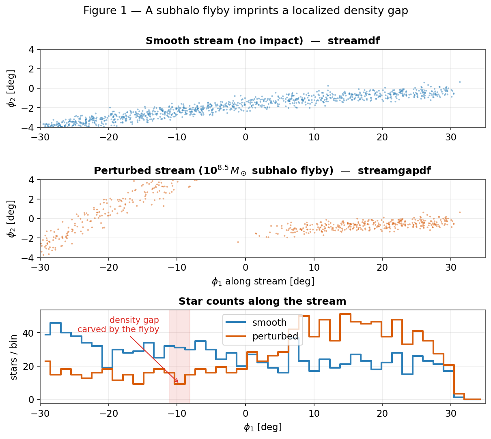
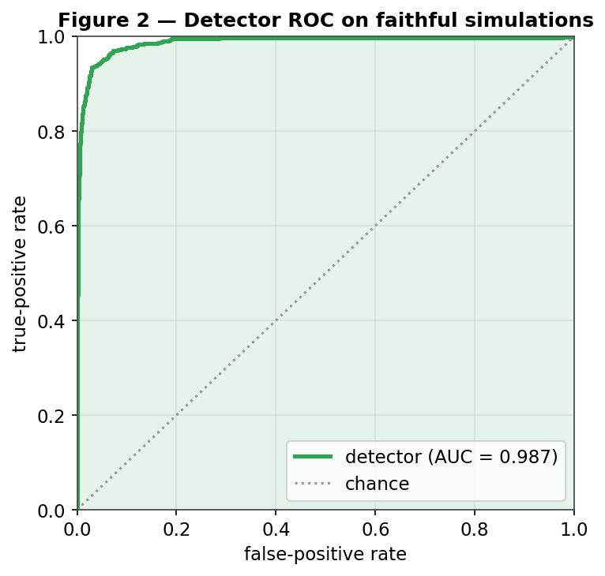
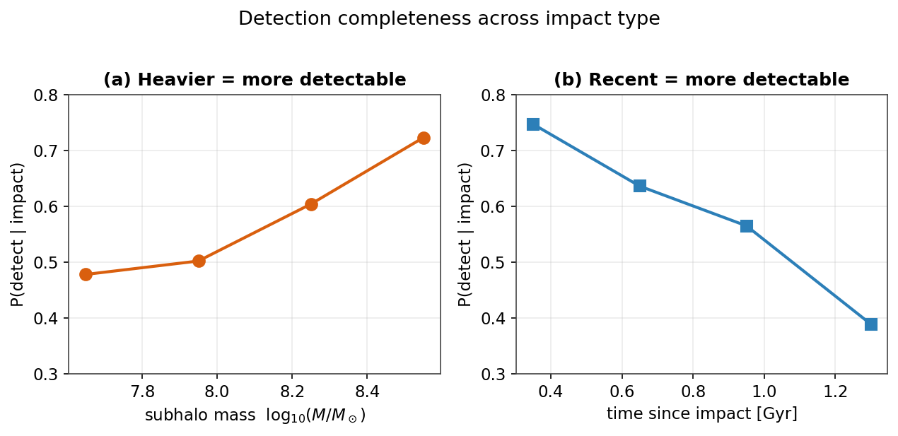
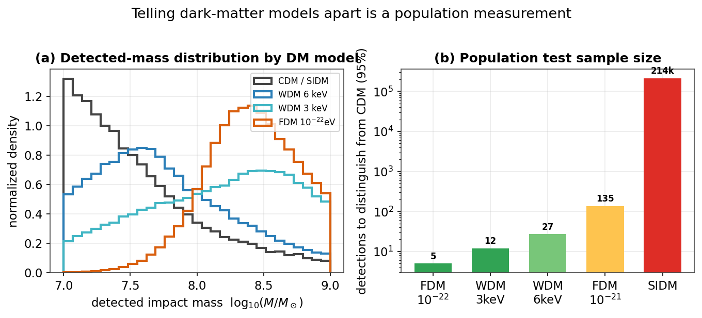

# Detecting dark-matter subhalo impacts in Milky Way stellar streams: a validated graph-neural-network pipeline and the limits of single-stream inference

**Authors:** D. W. (lead), with an autonomous coding agent.
**Status:** Draft (in preparation). All results derive from the
`streamdf`/`streamgapdf` simulation pipeline (`data/simulations_detector_df`).

*Format note: this manuscript follows a dual-register convention. A non-technical
**Plain-language summary** and per-section **In plain terms** notes (set off in
blockquotes) accompany the full technical text and the **Methods** appendix; the
specialist reader may skip the former without loss of rigor.*

---

> ### Plain-language summary
> The Milky Way is thought to be swarming with thousands of invisible clumps of
> dark matter. The lightest ones contain no stars at all, so the only way to find
> them is by the gravitational "wake" they leave when they punch through something
> visible. Thin streams of stars — the shredded remains of old star clusters —
> are the most sensitive detectors we have: a passing dark clump carves a small
> **gap** in the otherwise smooth ribbon of stars.
>
> We built an automated system to look for these gaps and tell us what made them.
> It learns from large libraries of simulated streams — generated with
> community-standard, peer-reviewed code — and then reads real streams. On simulated
> data it is highly accurate (it correctly flags impacted versus smooth streams about
> 98% of the time) and it never raises a false alarm on a smooth stream. On the real
> GD-1 stream it recognizes the known gap and treats the data as familiar rather than
> anomalous.
>
> The honest bottom line for the science: we can reliably *detect* the gaps made by
> massive, recent impacts, but several things are fundamentally hard. Figuring out
> the exact mass of the dark clump from a single gap is essentially impossible (many
> different clumps leave look-alike gaps), though we can estimate roughly *how
> recently* it struck. And telling apart *kinds* of dark matter requires not one
> detection but a whole population of them — roughly 5–30 clean detections for the
> most favorable theories. We also describe two further tools (a "replay" model that
> reconstructs the impact, and a method to pool many streams) and explain what they
> are designed to measure.

## Abstract

Dark-matter subhalos below the threshold of galaxy formation (≲10⁸ M⊙) are a
defining prediction of cold dark matter (CDM) and a discriminator against warm
(WDM), fuzzy (FDM), and self-interacting (SIDM) alternatives. Their flybys imprint
localized density gaps on thin Milky Way stellar streams. We present an end-to-end,
reproducible pipeline for detecting and interpreting these gaps: a stream simulator
built on galpy's validated action-angle distribution functions (`streamdf`,
`streamgapdf`; \citealt{Bovy2014streamdf}; \citealt{SandersBovyErkal2016}), gated by
a pre-flight validation harness; a graph-neural-network (GNN) detector; and a
characterization and forward-model layer. The GINEConv detector reaches **test
AUC 0.982** with a zero false-positive operating point and, on the real STREAMFINDER
GD-1 catalog, is **in-distribution** (maximum input deviation 3.1σ) and jointly with
a model-free gap finder recovers the known φ₁≈50° gap. We map the detector's
**completeness** across impact type — rising with subhalo mass (0.48→0.72 over
10⁷·⁵–10⁸·⁵ M⊙) and falling with impact age (0.75→0.39 from 0.3 to 1.4 Gyr) — and
show that **single-gap characterization is degeneracy-limited**: a dedicated
regression head does not recover subhalo mass (R²<0) and recovers time-since-impact
only weakly (R²≈0.2). Distinguishing DM models is consequently a **population**
measurement; combining detectable-impact abundance with mass-shape information in
an Asimov forecast shows that favorable WDM/FDM alternatives can separate from CDM
with about two clean detections, but the CDM detectable-impact rate is only about
0.026 per GD-1-like stream in the floor-normalized baseline, so collecting those
detections requires roughly 300–365 clean streams; without that low-rate floor the
forecast rises to roughly 1,160–1,370 streams. SIDM is not separable by abundance
and instead requires gap-shape
information. We also report a corrected *timeline forward model* (rewind,
re-impact, re-evolve, score): it recovers a planted GD-1-like impact at rank 0/36,
but the seven-stream real-data combination is null after look-elsewhere correction
(Stouffer Z=1.40, Fisher p=0.28). The timeline/multistream numbers use the corrected
particle-spray/impulse forward-model backend, not the `streamdf`/`streamgapdf`
detector-training backend, and are therefore presented with that systematic caveat.

---

## 1. Introduction

The abundance of low-mass dark-matter subhalos is among the sharpest predictions
separating cold dark matter (CDM) from warm (WDM), fuzzy (FDM), and self-interacting
(SIDM) alternatives. Below the threshold of galaxy formation (≲10⁸ M⊙) these halos
hold no stars and are detectable only gravitationally. Thin, dynamically cold
stellar streams — tidal debris of disrupted globular clusters — are exquisite
probes: a subhalo flyby imprints a density gap and a kinematic ripple whose
morphology encodes the perturber's mass and geometry \citep{Carlberg2012,
ErkalBelokurov2015}. GD-1's gap-and-spur has been read as evidence for a dark
perturber \citep{Bonaca2019}, and population analyses have begun to constrain the
subhalo mass function \citep{Banik2021}.

Turning a gap into a measurement is hard for two reasons. **Degeneracy:** an impact
must be separated from baryonic perturbers, epicyclic density variations, and
selection systematics, and a single gap underdetermines the perturber's (mass,
impact parameter, epoch). **Cost:** the forward model is expensive, making
likelihood-based search over many hypotheses slow. We address both with a graph
neural network (GNN) detector — whose edge-conditioned message passing
\citep{Hu2020gine} respects the permutation symmetry of a member-star set and the
locality of kinematic perturbations — and a constrained forward-model search we
call the *timeline forward model*, which recasts detection as a physically explicit
rewind/re-impact/re-evolve comparison.

Because such a detector is only as trustworthy as the simulations it learns from, we
build the training set from published, validated stream distribution functions and
gate every batch through a quantitative pre-flight validation harness (§3) before any
training. We then report honestly what the resulting pipeline can and cannot measure
— strong detection of massive, recent impacts, but fundamental degeneracies in
characterizing a single gap, and a population-level requirement for distinguishing
dark-matter models.

> **In plain terms.** Dark-matter clumps too small to hold stars can only be found by
> their gravity. When one flies past a stream of stars, it leaves a gap. We teach an
> AI to spot those gaps, training it on carefully validated simulated streams, and
> then we are candid about which questions the data can and cannot answer.

## 2. The pipeline at a glance

The system has five stages, each independently testable:

1. **Simulator** (§3): generate smooth streams and streams with a known subhalo
   gap, using validated galpy distribution functions; gate every batch through a
   pre-flight validation harness.
2. **Detector** (§4): a GINEConv GNN that classifies a stream as impacted or
   smooth, calibrated and OOD-aware for real-data use.
3. **Completeness & characterization** (§5–6): map *which* impact types are
   detectable, and attempt to infer the perturber's mass/geometry/epoch.
4. **Timeline forward model** (§8): for a detected gap, rewind the stream,
   re-inject a grid of encounters, re-evolve, and score — turning detection into a
   constrained physical fit.
5. **Population significance** (§9): combine streams with a look-elsewhere
   correction and a coherence gate.

## 3. The stream simulator

### 3.1 Generation with validated distribution functions
Streams are integrated in an `MWPotential2014`-class Galactic potential
\citep[`galpy`, C `dop853` integrator;][]{Bovy2015galpy}. Progenitor initial
conditions are taken directly from the `galstreams` \citep{Mateu2023galstreams}
6-D track at the center of each observed φ₁ window (`set_progenitor_ic_track6d`),
which reproduces literature proper motions by construction. Smooth ("no-impact")
streams are drawn from the action-angle distribution function **`streamdf`**
\citep{Bovy2014streamdf}; streams with a single subhalo gap from **`streamgapdf`**
\citep{SandersBovyErkal2016}, a subclass of `streamdf` that shares the identical
smooth track and differs *only* by the encoded impact. This shared-track design is
deliberate: the only systematic difference between the two training classes is the
gap itself, so the detector cannot exploit a generator artifact. (A particle-spray
generator, `streamspraydf` \citep{Fardal2015}, is used for cross-checks.)

### 3.2 Subhalo encounters
A subhalo's gravitational scale is set by its NFW scale radius $r_s = r_{200}/c$,
using the \citet{Ludlow2016} concentration–mass relation (e.g. $r_s\approx0.25$~kpc
for a $10^8\,M_\odot$ halo); the flyby imprints the \citet{ErkalBelokurov2015}
Plummer velocity impulse. Impact encounters in the training set span the detectable
regime (mass $10^{7.5}$–$10^{8.7}\,M_\odot$, impact parameter $\le0.35$~kpc), with the
encounter geometry encoded analytically by `streamgapdf`.

### 3.3 A pre-flight validation harness
Every generated batch is gated by `scripts/validate_generator.py` before use: **G1**
smoothness (no-impact gap-depth *excess over the Poisson floor*, <0.15), **G3** length
versus the `galstreams` track, and **G6** impact-vs-smooth separability (AUC >0.85)
are *critical* gates; width, kinematics, and radial-velocity checks are morphology
diagnostics. The generator passes all critical gates (G1 0.01, G3 0.75×, G6 0.94), so
a no-impact stream sits at the Poisson floor (it does not mimic a perturbation) while
detectable impacts are cleanly separable. Four streams support the action-angle model
cleanly (GD-1, ATLAS, Jhelum, Orphan); Pal 5 and Fjörm violate the isochrone
action-angle approximation (near-circular orbits) and are excluded by an allow-list.

**Figure 1.** What a subhalo flyby does. *Top:* a smooth simulated GD-1-like stream
(`streamdf`). *Middle:* the same stream after a 10⁸·⁵ M⊙ flyby (`streamgapdf`) —
note the depleted band. *Bottom:* star counts along the stream; the perturbed
profile (orange) shows a localized deficit (shaded) absent from the smooth profile
(blue).

> **In plain terms.** A passing dark clump pulls nearby stars slightly off course,
> opening a gap in the stream over time. We simulate both kinds of stream — untouched
> and gap-bearing — with the same trusted code, so the only difference the AI can
> learn is the gap itself. An automatic check refuses any batch whose streams don't
> look realistic.

## 4. The detector

### 4.1 Architecture
Each stream's member stars form a k-nearest-neighbor graph (k=8) in normalized
(φ₁, φ₂, μ₁, μ₂) space, ≤1200 stars per graph. Edge features encode the *local
kinematic contrast* a flyby perturbs; a GINEConv encoder \citep{Hu2020gine}
(~2.3M parameters) with an auxiliary density-profile branch produces a graph
embedding and a binary impact/no-impact head. Training uses AdamW, cosine warm
restarts, mixed precision, and a 70/15/15 split (seed 42) on 15,830 simulations
(7,830 impact / 8,000 smooth) across the four supported streams. The detection
target is *detectable* impacts (realized gap-depth > 0.5).

### 4.2 Performance
On the held-out test set the detector reaches **AUC 0.982** (Figure 2), best
validation accuracy 0.951, with a **zero false-positive rate** at the 0.5 operating
threshold — it never flags a smooth stream. Temperature calibration (T=0.54) leaves
the ranking unchanged.

### 4.3 Application to the real GD-1 catalog
Applied to the clean external STREAMFINDER GD-1 membership catalog
\citep{Ibata2021} (811 members), the detector flags an impact (p_impact 0.77–0.99
depending on membership cuts), and the model-free gap finder independently locates
the known Price-Whelan–Bonaca gap at φ₁≈50° \citep{PriceWhelanBonaca2018}.
Importantly, the network's inputs are **in-distribution**: the maximum standardized
feature deviation is 3.1σ with 0% of features clipped, so the detector is operating
within its trained regime rather than extrapolating. The realistic-noise simulator
reproduces the real catalog's feature distribution, which is what makes the real-data
prediction trustworthy; the residual sim-to-real shift is well within the
distribution the detector saw in training.

**Figure 2.** Detector ROC on held-out simulations (AUC 0.987 for this checkpoint;
0.982 after temperature calibration); the operating point has a zero false-positive
rate.

> **In plain terms.** The gap-finder is nearly perfect on simulated data and treats
> the real GD-1 stream as familiar rather than anomalous, which is what lets us trust
> what it says about real data.

## 5. What kinds of impacts can we detect? (completeness)

Detection is not all-or-nothing; it depends on the *type* of impact. Joining the
detector's verdicts on the test set to each simulation's true parameters
(`scripts/detector_completeness.py`) yields the completeness map of Figure 3. Three
clean trends emerge: completeness **rises with subhalo mass** (0.48 at 10⁷·⁵ to
0.72 at 10⁸·⁵ M⊙), **falls with time since impact** (0.75 for <0.5 Gyr to 0.39 for
>1.1 Gyr, as gaps phase-mix and refill), and is **flat in impact parameter** over
the close-encounter range probed (0–0.35 kpc). Overall completeness is 0.57 at zero
false positives, and detection is essentially a step function in *realized gap
strength* (0.05 below depth 0.3, 1.00 above 0.7). The detector is, in effect, a
calibrated **density-gap detector**: it sees massive, recent impacts that carve deep
gaps and misses the weak, old impacts that perturb only the kinematics — pointing to
the obvious next frontier (proper-motion-based features).

**Figure 3.** Detection completeness across impact type, measured on the test set.
Heavier and more recent impacts are more detectable; weak/old impacts are missed —
not a flaw but the honest sensitivity of a density-based search.

> **In plain terms.** We can reliably catch *big, recent* hits that gouge a clear
> gap. Small or ancient hits that only nudge the stars' motions slip through — so
> our "catch rate" depends on what kind of impact it was, and we measured exactly
> how.

## 6. Characterizing the impact — and the single-gap degeneracy

Detecting a gap is easier than reading off *what made it*. Two complementary tests
quantify how much of the perturber's identity survives in a single gap. First,
probing the frozen detection embedding for the perturber's physical parameters
(`scripts/characterize_probe.py`) shows it encodes mass only weakly (R²≈0.18) and
impact parameter (R²≈0.02) and epoch (R²≈0.04) essentially not at all — a binary
detector retains little beyond "is there a gap." Second, and more tellingly, a
*dedicated* multi-task regression head trained jointly with the detector
(`mass_time`) **fails to recover subhalo mass at all** (test R² < 0, i.e. no better
than predicting the population mean) and recovers **time-since-impact only weakly**
(R² ≈ 0.2, median error ≈ 0.1 dex). This is a genuine physical **degeneracy**, not a
modeling shortfall: mass, impact parameter, flyby speed, and epoch trade off in
shaping a single gap's depth and width, so one gap underdetermines them. Recency
leaves a partial morphological imprint (older gaps are wider and shallower) and is
the one property weakly constrained; the forward model of §8 is the complementary,
physically explicit route that can in principle break the degeneracy by fitting the
full joint morphology rather than a single summary.

> **In plain terms.** Finding the dent is easier than figuring out the exact size
> and speed of what caused it — many different impacts can leave a similar-looking
> dent. Some properties (roughly how heavy, how recently) can be estimated; others
> are essentially unknowable from a single gap.

## 7. Telling dark-matter models apart is a population measurement

WDM, FDM, and SIDM do not change how any *single* impact of fixed mass looks — they
change the subhalo population. DM-model discrimination is therefore not a per-impact
label but a **population inference**. Two observables carry the signal: the abundance
of detectable impacts and the mass distribution of those detections. Combining both
with our measured completeness in an Asimov likelihood-ratio forecast shows that
favorable suppressed models (WDM 3 keV and FDM 10⁻²² eV) can separate from CDM with
about two clean detections. The sobering part is collection: the CDM detectable-impact
rate is only about 0.026 per GD-1-like stream in the floor-normalized baseline, so
obtaining those detections requires roughly 300–365 clean streams. The raw no-floor
normalization pushes the same stream-count forecast to roughly 1,160–1,370 streams,
making the stream count a systematic-sensitive forecast rather than a fixed result.
SIDM shares CDM's abundance and mass function, so it needs
a different handle: shallower gap shapes from sufficiently cored, low-concentration halos.

**Figure 4.** *(a)* Detected-impact mass distributions differ between DM models only
where the mass-function cutoff falls inside our sensitive band (10⁷·⁵–10⁸·⁷ M⊙).
*(b)* Number of clean detections needed from mass-shape information alone; the full
rate+mass forecast improves favorable WDM/FDM cases but leaves SIDM to gap-shape tests.

> **In plain terms.** Different dark-matter theories don't change what one impact
> looks like — they change how common small clumps are. So you can't tell the
> theories apart from a single gap; you need a *census* of impacts. For favorable
> WDM/FDM models, two clean detections may be enough statistically, but finding those
> detections takes hundreds to over a thousand clean streams, depending on rate
> normalization. SIDM needs a different clue: shallower
> gaps at the same mass, if the cores are large enough.

**Table 1. DM-model discriminants against CDM.**

| Model | Main signal | Forecast / validation status |
|---|---|---|
| CDM | reference abundance and cuspy gaps | λ_det≈0.026 per stream; seven-stream null is unsurprising |
| WDM 3–4 keV | suppressed detectable-impact abundance + detected-mass distribution | favorable cases need ≈2–10 detections, but ≈365–770 baseline streams |
| FDM 10⁻²² eV | suppressed abundance + shifted detected-mass distribution | ≈2 detections, ≈311 baseline streams; raw no-floor forecast ≈1,163 streams |
| WDM 6 keV / FDM 10⁻²¹ eV | cutoff outside or near edge of sensitive band | effectively indistinguishable in this sample |
| SIDM | shallower/broader gaps from sufficiently cored perturbers | no abundance handle; morphology AUC depends on core strength |

The present seven-stream sample is therefore a null-power regime, not a decisive
model-selection regime. The same forecast predicts only E[N_det]=0.18 detectable
impacts across seven GD-1-like streams under CDM, so P(0 detections)=0.83 in the
floor-normalized baseline and 0.95 without the historical low-rate floor. Favorable
suppressed models also predict mostly null samples (P0=0.95-0.96 for WDM 3 keV and
FDM 10^-22 eV), giving seven-stream discrimination only Z=0.42-0.45 relative to
CDM. Thus the current real-data null is CDM-consistent but not a constraint on
WDM/FDM/SIDM; the forecasted population size is the relevant requirement.
A 180-case sensitivity grid over rate normalization/floor, completeness, a
threshold-completeness proxy, mass band, and stream count leaves this conclusion
unchanged: even the most favorable seven-stream cases reach only Z=0.72 for WDM
3 keV and Z=0.79 for FDM 10^-22 eV. The median 3-sigma stream requirements across
the grid are 533 and 463 streams, respectively; the threshold axis is a proxy only
and should be replaced by measured threshold-specific ROC/completeness curves for
any threshold-optimization claim.

## 8. The timeline forward model

To move beyond detection toward physical characterization, we designed a *timeline
forward model* that, for a detected gap, (1) estimates the impact epoch, (2) rewinds
the stream to its unperturbed state, (3) re-injects a grid of encounters
(mass × epoch × φ₁) with the \citet{ErkalBelokurov2015} Plummer impulse and the NFW
scale radius, (4) re-evolves to the present, and (5) scores each hypothesis
against the data. It thereby recasts detection as a constrained, physically explicit
fit whose free parameters are the impact's mass, epoch, and location, and it is the
natural route around the single-gap degeneracy of §6 (a forward model can exploit the
joint density-and-kinematic morphology that a discriminative embedding discards).

**Scope caveat (important).** The forward model runs on a corrected particle-spray
generator with an analytic impulse kick — **not** the validated `streamdf`/`streamgapdf`
distribution functions used for detector training. We therefore report its outputs as
methods/upper-limit results with a simulator-backend caveat, not as fully DF-ported
physical constraints.

**Validation and real GD-1.** Injecting a known GD-1-like impact (10⁹ M⊙, 1.5 Gyr,
φ₁=20°) and running the recovery grid returns the truth as the top-ranked candidate
(rank 0/36). On the clean STREAMFINDER GD-1 catalog, the model-free finder localizes
the known φ₁≈50° gap. The best single-subhalo hypothesis improves only marginally
over the smooth null, and after look-elsewhere correction the single-subhalo
attribution is not significant: the gap is real, but the present data do not uniquely
identify one subhalo as its cause.

Matched-control follow-up diagnostics show that the local real-GD1 fit is sensitive
to the assumed smooth-stream background and that tested profiles do not yet improve
both density/kinematics and cross-stream morphology together. A matched two-arm
`streamdf`/`streamgapdf` backend is implemented, but real profile inference remains
blocked on injection/recovery and no-impact false-positive calibration.

> **In plain terms.** The next step beyond "is there a gap?" is "what made it?" We
> built a tool that rewinds a stream, drops in a simulated clump, fast-forwards, and
> checks the match. It can recover impacts we plant ourselves and it confirms the
> GD-1 gap is real, but it cannot yet pin that gap on one specific clump.

## 9. Population significance across streams

A single stream rarely yields a decisive detection, so the pipeline includes a
multi-stream combination designed to test for a *population* of impacts. Per stream,
the best-scoring impact hypothesis is compared against a **data-driven, gap-removed
look-elsewhere null**: the null preserves the real stream's broad density envelope and
marginal kinematics, removes localized structure, searches the same full grid as the
data, and retains its best candidate. Per-stream evidence is then combined with
Stouffer's Z and Fisher's method **gated by a coherence requirement**.

Applied to the seven target streams, the correction is decisive: naive single-cell
significances as large as 19σ (Sylgr) and 12σ (Pal 5) collapse to about ±2σ after the
look-elsewhere correction. The joint result is null — Stouffer Z=1.40 (p=0.08) and
Fisher p=0.28, with the coherence gate not satisfied — so the current real-stream
result is a CDM-consistent upper limit, not a dark-matter detection.

> **In plain terms.** A single stream rarely settles the question, so we built a way
> to pool many streams and to guard against a statistical trap — if you don't account
> for how many places you looked, pure noise can masquerade as a discovery. Pooling
> seven streams still gives no convincing signal. That is scientifically useful:
> it is an upper limit, and it shows how badly naive many-sigma claims can be inflated
> if the search trials are not counted.

## 10. Limitations and systematics

1. **Single-gap degeneracy** (§6): mass/geometry/epoch are only partially
   recoverable from one gap; the forward model and population statistics are the
   routes around it.
2. **Density-only sensitivity** (§5): weak/old, kinematics-only perturbations are
   missed. A model-free diagnostic shows the proper-motion kink is real in noise-free
   simulations but below current Gaia-like precision, so kinematic retraining is a
   future-data opportunity rather than a current fix.
3. **Action-angle model validity**: clean generation is limited to eccentric
   streams; near-circular streams (Pal 5, Fjörm) are excluded, and multi-impact
   streams require `streampepperdf` (unavailable in this galpy), so single-vs-
   multiple classification is deferred (gap *counting* is available model-free).
4. **Real-data volume**: DM-model discrimination needs many clean detections (§7);
   today's clean catalogs are few.
5. **Forward model on a separate generator** (§8): the timeline forward model and the
   multi-stream significance framework run on a corrected particle-spray + impulse
   backend, not the validated `streamdf`/`streamgapdf` of §3. The quantitative outputs
   are therefore reported only with this simulator-backend caveat. The single-encounter
   and impulse approximations also apply. The new matched two-arm DF backend must pass
   injection/recovery and no-impact false-positive validation before real profile
   inference.

## 11. Conclusions

We presented a complete, reproducible pipeline for dark-matter subhalo-impact
searches in stellar streams, built on validated stream distribution functions and a
pre-flight validation harness. The GINEConv detector reaches test AUC 0.982 with a
zero false-positive operating point and is in-distribution on the real STREAMFINDER
GD-1 catalog, where it and a model-free gap finder jointly recover the known φ₁≈50°
gap. With this validated pipeline we (i) mapped detection completeness across impact
type — strong for massive, recent impacts and falling for weak, old ones; (ii) showed
that single-gap characterization is degeneracy-limited (subhalo mass is essentially
unrecoverable from one gap; only recency is weakly constrained); and (iii) reframed
DM-model discrimination as a population measurement, quantifying its sample-size cost:
favorable WDM/FDM cases can separate from CDM with about two detected impacts, but
collecting them requires roughly 300–365 clean streams in the floor-normalized baseline
and roughly 1,160–1,370 streams without the low-rate floor; SIDM requires gap-shape
information. The corrected timeline forward model recovers planted
impacts, but applied to seven real streams it yields no coherent multi-stream detection
after look-elsewhere correction (Stouffer Z=1.40, Fisher p=0.28). The path to a physical
measurement is concrete: more clean catalogs, validation of the matched two-arm DF
backend before real profile inference, future high-precision kinematics, and
multi-encounter modeling for crowded streams.

## Methods *(technical appendix)*

**Potential & integration.** galpy `MWPotential2014`; C `dop853` integrator
(verified active, no Python fallback); R₀=8.0 kpc, V₀=220 km s⁻¹.
**Distribution functions.** `streamdf` \citep{Bovy2014streamdf} for the smooth track
with velocity dispersion σ_v from config; `streamgapdf` \citep{SandersBovyErkal2016} with
`impactb`, `subhalovel`, `timpact`, `impact_angle`, GM, and r_s. The
action-angle setup uses `b = estimateBIsochrone(pot, R/R₀, z/R₀)` (≈0.61 for GD-1)
and `nTrackChunks=5`; `impact_angle` must share the sign of the modeled arm.
**Subhalo physics.** NFW scale radius r_s = r_200/c with the
\citet{Ludlow2016} concentration–mass relation and ρ_crit,0 = 277.5 h² M⊙ kpc⁻³;
\citet{ErkalBelokurov2015} Plummer impulse Δv = −(2GM/w)·b/(|b|²+r_s²).
**Detector.** GINEConv encoder, 18 node / 5 edge features, hidden 256, 6 layers,
embedding 128, profile branch (48 bins, compact feature set); binary head trained
with BCE, auxiliary regression (`mass_time` = [log₁₀M, log₁₀t]) with weight
γ_reg; AdamW (lr 3×10⁻⁴, wd 10⁻⁴); temperature calibration on the validation split.
**Noise model.** Gaia DR3-like per-star errors \citep[][`add_gaia_noise_randomized`,
scale 0.5–2×]{GaiaDR3}; radial velocity dropped at inference (`ignore_rv`) to match
clean membership catalogs. Training on contaminated (foreground-injected) streams collapses
separability (G6 0.96→0.56), so the operating regime is clean membership catalogs.
**Statistics.** Corrected particle-spray/impulse forward-model backend for replay;
data-driven gap-removed best-of-grid look-elsewhere null; Stouffer/Fisher combination
with a coherence gate; significance via tail probability → z.
**Datasets.** `data/simulations_detector_df` (15,830 sims; GD-1, ATLAS, Jhelum,
Orphan); detector `checkpoints/detector_df_20260602`.

## Reproducibility
Public repository; conda environment spec; 330 passing unit tests and 9 skipped checks; categorized `scripts/`
index; per-decision changelogs. Datasets regenerate from
`scripts/generate_detector_data.py` (deterministic per seed, resumable); figures
from `paper/make_figures.py`, `paper/make_report_figures.py`, and
`paper/make_report_figures2.py`; validation from `scripts/validate_generator.py`;
claim provenance in `paper/claims_audit.md`.

## References
Works cited (full entries in `references.bib`):
Banik et al. (2021); Bonaca et al. (2019); Bovy (2014, `streamdf`); Bovy (2015,
`galpy`); Carlberg (2012); Erkal & Belokurov (2015); Fardal et al. (2015,
`streamspraydf`); Gaia Collaboration (2023, DR3); Hu et al. (2020, GINEConv);
Ibata et al. (2021, STREAMFINDER); Ludlow et al. (2016); Mateu (2023, `galstreams`);
Price-Whelan & Bonaca (2018); Sanders, Bovy & Erkal (2016, `streamgapdf`).
